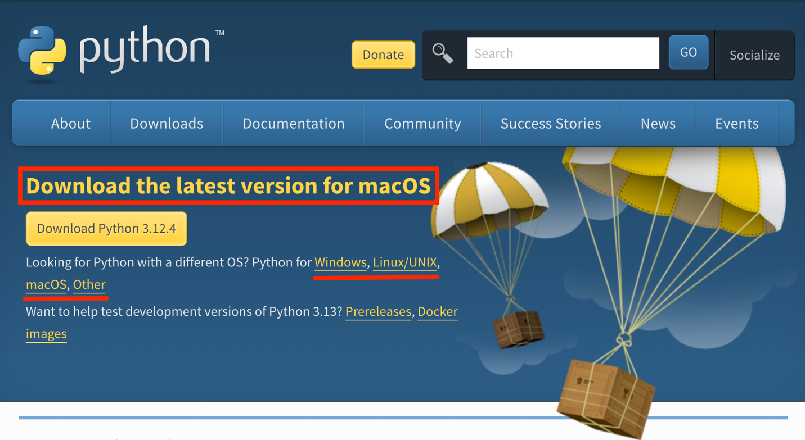
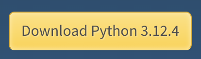
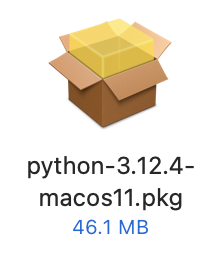
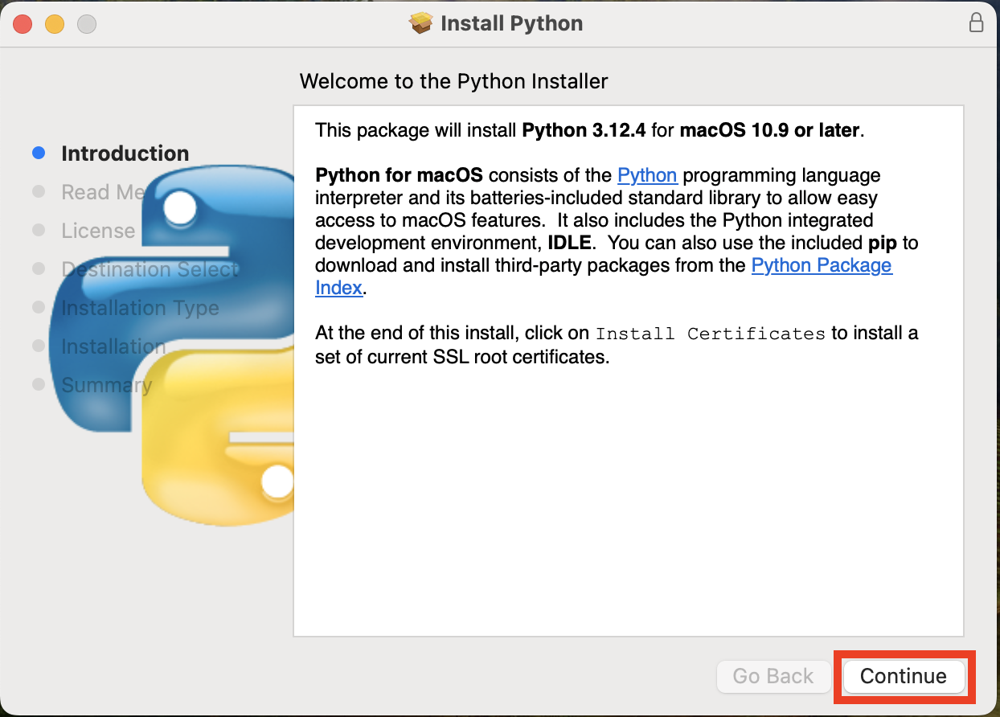
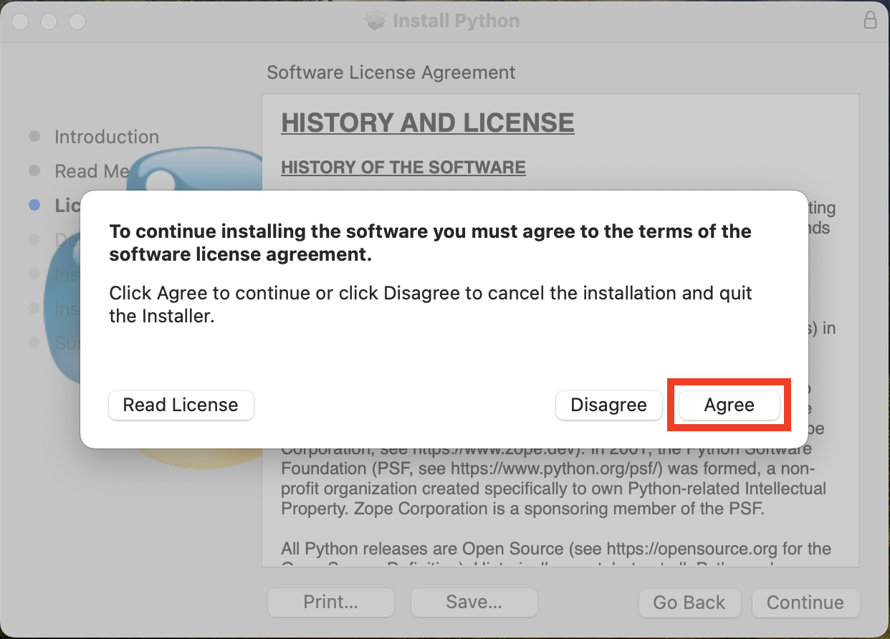
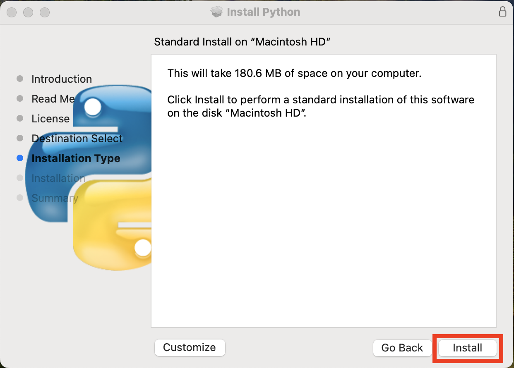
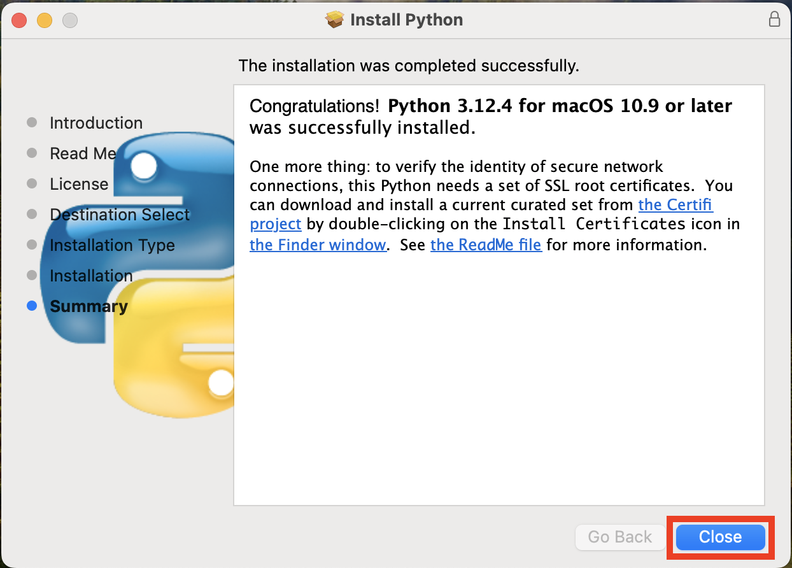

> *This tutorial will show you how to download and install Python on
> MacOS.*

## Table of Contents

[What is Python? [1](#what-is-python)](#what-is-python)

[How to Download Python
[1](#how-to-download-python)](#how-to-download-python)

## What is Python?

Python is a general purpose programming language. It is free to download
and use. This programing language will be useful for processing
ECOSTRESS data.

# How to Download Python

1.  Start by going to <https://www.python.org/downloads/> or by
    searching the web for Python download. Make sure that the device
    listed at the top after **Download the latest version for**… matches
    your device. If it does not, see the options listed below to change
    it to match your device.

2.  Once the device listed is correct, click the yellow **Download
    Python 3.12.4** button. The version number may be different, but
    that is okay.

3.  Next, navigate to your downloads folder and look for the **Python
    installation package**. Double click on it to launch it.

4.  An **Install Python** window should open. Select the **Continue**
    button on the bottom right for the **Introduction**, **Read Me**,
    and **License** pages.

5.  After selecting **Continue** on the **License** page, a pop-up will
    appear asking you to agree to the terms. Select **Agree**.

>  style="width:5.05577in;height:3.63087in"
> alt="Graphical user interface, text, application Description automatically generated" />

6.  Next, the **Installation Type** window will appear. Click
    **Install**.

7.  Once Python has been installed, the **Summary** page will show that
    the installation was completed successfully. Additionally, a finder
    window may open with the downloaded files. Click **Close**. It may
    prompt you to move the Python installer to the trash, which you can
    do at this point if you want to.

You now have Python installed on your device! Happy coding!
