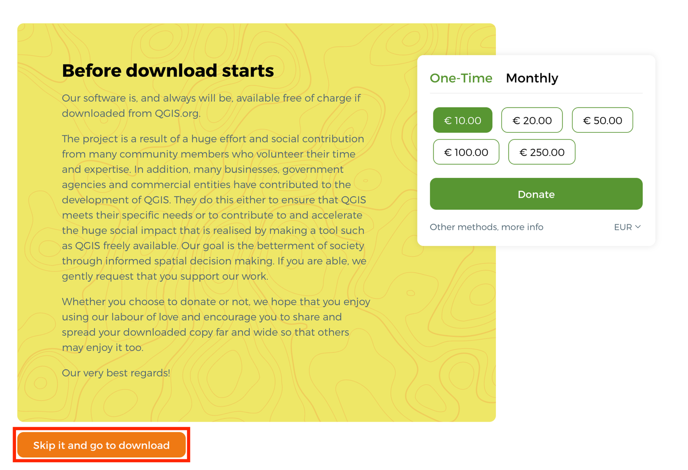

> *This tutorial will show you how to download and install QGIS on
> MacOS.*

# Table of Contents

[What is QGIS?](#what-is-qgis)

[How to Download QGIS](#how-to-download-qgis)

[Preparing QGIS for use with ECOSTRESS Data](#preparing-qgis-for-use-with-ecostress-data)

# What is QGIS?

QGIS is an open-source Geographic Information System used to display and
analyze geographic data. QGIS is free to the public and is user
friendly. QGIS can be used for interacting with vector and raster data.

## How to Download QGIS

1.  Start by going to <https://www.qgis.org/en/site/> or by searching
    the web for QGIS. The page should look something like this:

2.  Select the green **Download** button.

>  style="width:5.5891in;height:2.9289in"
> alt="Text Description automatically generated" />

3.  The new screen that pops up will ask you if you would like to make a
    donation. You can do so if you want to, or select **Skip it and go
    to download**.

4.  Select the green **Long Term Version for Mac OS** button to begin
    downloading the newest version of QGIS.

5.  A file should appear in your downloads looking like this.

6.  Double click on the download to launch it. Once launched, a window
    will appear asking you to agree to the terms of the license. Select
    **Agree**.

>  style="width:4.00995in;height:2.85195in"
> alt="Graphical user interface, text, application, email Description automatically generated" />

7.  Once you agree, a pop up will appear prompting you to add QGIS to
    your applications. Drag and drop the **QGIS** icon into the
    **Applications** folder icon. It may take some time to copy over.

Now QGIS has been installed on your computer!

**  
**

## Preparing QGIS for use with ECOSTRESS Data

1.  Now that you have QGIS on your device, lets prepare it for use with
    ECOSTRESS data by adding **basemaps**. For your first time opening
    QGIS, start by navigating to your **Applications** folder, **right
    clicking** on QGIS, and selecting **Open**.

2.  A warning will pop up asking if you are sure that you want to open
    this application. Select **open**. You should only need to do this
    the first time that you open QGIS. For all other times, you can
    simply double click on the application to open it.

**Tip**: If the pop-up warning does not give you an option to **Open**
on the first try, select **Cancel** and again **right click** on QGIS
and select **Open** from the dropdown menu. The **Open** option should
now appear in the warning pop-up.

3.  QGIS should open looking something like this:

>  style="width:5.97207in;height:3.2891in"
> alt="Graphical user interface, application, Word Description automatically generated" />

4.  Next, lets add a plugin to allow us to use **basemaps**. With the
    application open, select for **Plugins** on the menu bar.

>  style="width:5.83913in;height:2.41987in"
> alt="Graphical user interface, application, Word Description automatically generated" />

5.  From the drop-down options, select **Manage and Install Plugins...**

>  style="width:4.5833in;height:1.51218in"
> alt="Graphical user interface, text, application, chat or text message Description automatically generated" />

6.  A Plugins window should appear looking like this:

7.  In the search bar, type in **HCMGIS**. Once you have found HCMGIS,
    click **Install Plugin**. A notification will appear saying “Plugin
    installed successfully.”

>  style="width:5.68072in;height:3.125in"
> alt="Graphical user interface, text, application, Word Description automatically generated" />

8.  Close the plugin window. There should now be a new option in the
    menu bar titled **HCMGIS**. Select this option.
    

9.  Under the HCMGIS dropdown, hover over **Basemaps** to see all of the
    options. For now, we can select **Google Satellite**.

>  style="width:2.81944in;height:3.75703in"
> alt="Graphical user interface, text, application, chat or text message Description automatically generated" />

10. Now a basemap should appear on your screen, as well as a Google
    Satellite layer toggled on under the **Layers** panel. You can
    practice toggling the layer on and off by pressing the box next to
    the Google Satellite layer to check or un-check it.

11. You can also practice navigating the map by using the tools provided
    at the top of the window. Select the white hand icon to access the
    **pan map** tool. With this tool you can click on the map, hold, and
    drag it to a different location. You can also use the **magnifying
    glass** icons to control how much **zoom** you would like. Select
    the magnifying glass with the plus sign and click on a place to zoom
    into. Alternatively, you can click and drag to create a box over an
    area you would like to zoom into. To zoom out, select the magnifying
    glass with the minus sign and click on the map.

>  style="width:1.94444in;height:0.56944in"
> alt="A close-up of a logo Description automatically generated with low confidence" />

12. Let’s save this project so we can keep working on it. Select the
    blue save button in the top left corner of the window and follow the
    prompt to name your project and select a location for it to save to.
    You will know that you have successfully saved the project when the
    top of the screen changes from **\*Untitled Project** to whatever
    you have named your new project.

You now have a project in QGIS set up for working with ECOSTRESS data!
