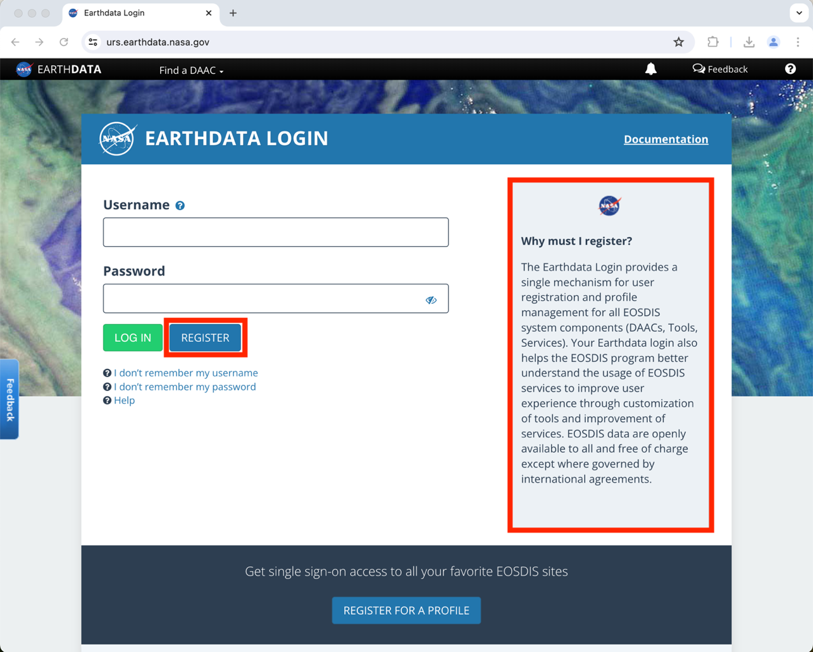
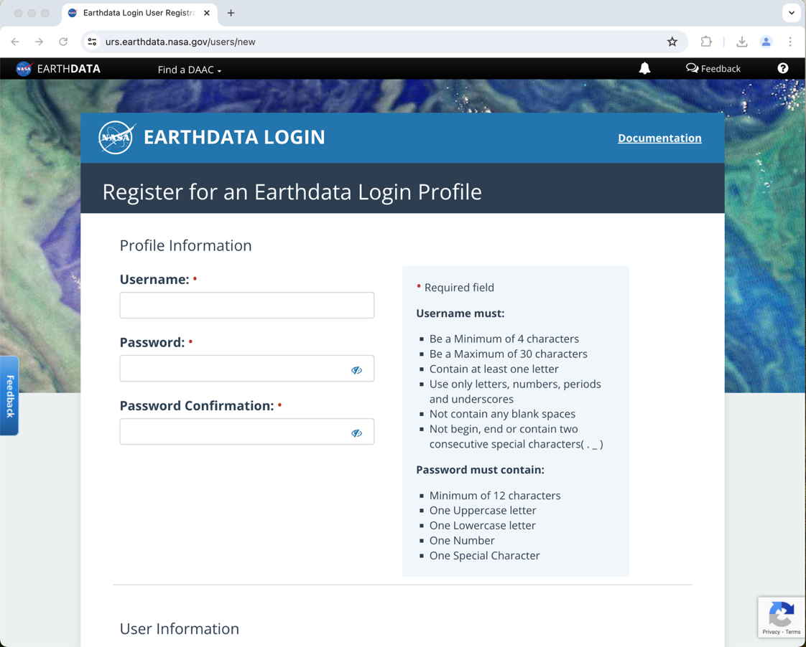
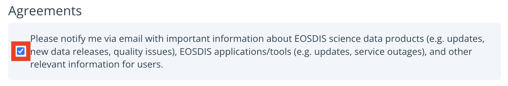
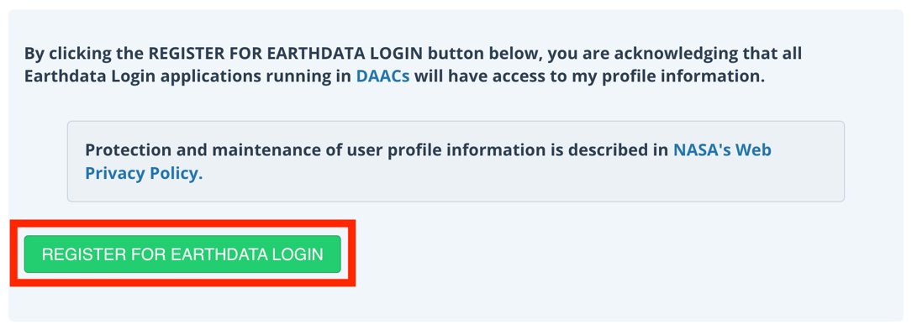
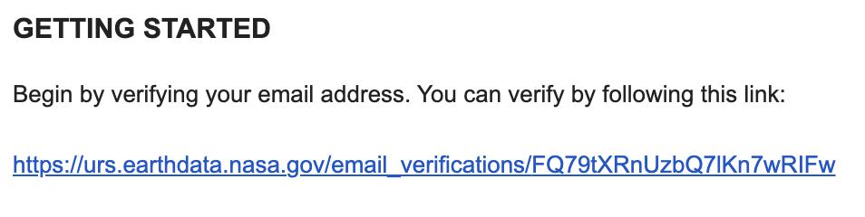

> *This tutorial will show you how to create an Earthdata Login.*

# Table of Contents

[What is NASA’s Earthdata? Why do I need a Login?](#what-is-nasas-earthdata-why-do-i-need-a-login)

[How to Create an Earthdata Login](#how-to-create-an-earthdata-login)

# What is NASA’s Earthdata? Why do I need a Login?

NASA’s Earthdata is an open access source to NASA’s Earth data
collections. It is managed by NASA’s Earth Observing System Data and
Information System (EOSDIS). Data on this platform comes from a variety
of sources, including ECOSTRESS. You must create an Earthdata login to
access the data provided by this resource.

## How to Create an Earthdata Login

1.  Start by going to
    [http://urs.earthdata.nasa.gov](http://urs.earthdata.nasa.gov/) or
    by searching the web for Earthdata and navigating to the register
    information. The page should look like this and have information
    about why you must register. Click the blue **Register** button.

2.  This should take you to a window where you can input your
    information. Fill out all the required fields as indicated by the
    red asterisks, including profile information, user information,
    country information, and affiliations.

>  style="width:5.09722in;height:4.09575in"
> alt="Graphical user interface Description automatically generated" />

3.  At the bottom of the page under **Agreements**, you can select if
    you would like to receive email updates about EOSDIS science data
    products or not by togging the checked box.

4.  When you have completed all fields, select the green **REGISTER FOR
    EARTHDATA LOGIN** button.

>  style="width:4.625in;height:1.67656in"
> alt="Graphical user interface, text, application, Teams Description automatically generated" />

5.  When your registration has been approved, you will receive an email
    from EOSDIS. The email will prompt you to verify your email. Click
    the link provided and login to verify your email. Once you have done
    so, it will let you know that your profile has been activated and
    prompt you to login.

>  style="width:4.41614in;height:1.11111in"
> alt="Graphical user interface, text, application Description automatically generated" />

6.  To login, go to
    [http://urs.earthdata.nasa.gov](http://urs.earthdata.nasa.gov/) or
    search the web for the Earthdata login page. This time, enter your
    new username and password and select the green login button. You now
    have access to NASA’s Earthdata!
