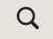

> *This tutorial will show you how to create an Environment on MacOS.*

# Table of Contents

[What is Homebrew?](#what-is-homebrew)

[How to Install Homebrew](#how-to-install-homebrew)

[What is Conda and Mamba?](#what-is-conda-and-mamba)

[How to install Conda and Mamba](#how-to-install-conda-and-mamba)

[What is an Environment?](#what-is-an-environment)

[How to Create an Environment](#how-to-create-an-environment)

# What is Homebrew?

Homebrew is a package manager that helps with the installation of
software. It is open-source and free to users. Homebrew allows us to
install the software we need all in the terminal.

## How to Install Homebrew

1.  Start by going to <https://brew.sh/> or by searching the web for
    Homebrew. On the webpage you will see a line of code under **Install
    Homebrew**. Click the clipboard icon next to the line of code to
    **copy** it.

2.  Now let’s open a terminal window. You can do this by selecting the
    **magnifying glass search icon** on the top right of your computer,
    searching for **Terminal**, and pressing enter.

>  style="width:0.41667in;height:0.30556in" />

3.  In the new terminal window, press **Command + V** to paste the
    copied code from Homebrew. Run it by pressing **Return**. You may be
    prompted to enter a passcode or PIN for your computer to continue.
    Type it in and press **Return**. Note that the terminal does not
    show characters as you type for security purposes.

4.  After entering your password, the code will run for a bit more
    before asking you to press **RETURN/ENTER** to continue. Press
    **Return** on your keyboard.

5.  Let it run a bit more, and then it will ask you to enter your
    passcode or pin one more time. Type it in and press **Return**.

6.  You will know that the installation is complete when you get to this
    screen with the **Installation successful!** message.

# What is Conda and Mamba?

Conda is a package management system used to install and manage
software. We can use it to create environments for different projects.
Mamba is a new version of Conda that works even faster to manage
environments. We will use Homebrew to install both Conda and Mamba.

## How to install Conda and Mamba

1.  Go to <https://formulae.brew.sh/cask/mambaforge> or search the web
    for Homebrew Mambaforge. Next to **Install command:** you will see a
    line of code. Click the clipboard icon next to the line of code to
    copy it.

2.  Navigate back to the terminal window and paste the copied line of
    code in it. Run the code. This code will install both **Conda** and
    **Mamba**.

3.  You will know it has been installed successfully when you get the
    line that says **mambaforge was successfully installed!**

# What is an Environment?

An environment is a separate place on your computer where you can
install software and libraries specific to the project you are working
on. This allows you to have multiple projects all with their unique
requirements. We need to create an environment that has all the tools we
need to work with ECOSTRESS data.

## How to Create an Environment

1.  Now that Conda and Mamba are installed, let’s create an environment
    that contains the python packages we need for geospatial analysis.
    Open a terminal window and type **mamba create -y -n ECOSTRESS -c
    conda-forge python=3.11 jupyter rioxarray hvplot** and run it. Here
    is an explanation of each part of that command:

    1.  **mamba create** is the command to make the environment.

    2.  **-y** confirms changes being made.

    3.  **-n ECOSTRESS** is used to name our environment. In this case
        the environment is being named **ECOSTRESS** but if you would
        like a different name, you can change it. Just make sure to keep
        the **-n** and not use spaces or special characters in your
        name.

    4.  **-c conda-forge** sets the channel where mamba will pull the
        packages from.

    5.  For the end of the command, we list all of the packages we want.
        Here is a description of each one we will use in our tutorial:

        1.  **python=3.12** connects to python, in this case setting it
            to version 3.12.

        2.  **jupyter** allows us to use jupyter notebooks.

        3.  **rioxarray** lets us open rasters.

        4.  **hvplot** will allow us to create maps.

**Tip**: If you get **Error: invalid option: -y**, re-run the code to
create the environment without the **-y**.

Example: **mamba create -n ECOSTRESS -c conda-forge python=3.11 jupyter
rioxarray hvplot**

2.  The code may run for a little bit. You will know that your
    environment has been **successfully** created when you get
    instructions on how to **activate** and **deactivate** your
    environment.

3.  Before we can activate the environment, we need to initialize mamba
    so that we can use it to run commands. In the terminal, type **mamba
    init zsh** and press **enter** to run it.

4.  It may prompt you to enter your **password** or **PIN**. Remember,
    as you type it in, the characters will not show up for security
    reasons. Once you have typed it in, press **Return**. If it does not
    ask you for this information, continue to the next step.

5.  Once you get to this screen, you will know that mamba has been
    initialized. **Close** **the terminal** to save this change.

6.  Now, to activate the environment, open the terminal again and type
    **mamba activate ECOSTRESS** into the terminal and run it.

7.  You will know that your new environment has been activated when you
    see the environment name, in this case **ECOSTRESS**, in parentheses
    before your line of code instead of (base).

> Now you have an environment set up to run your code with!
