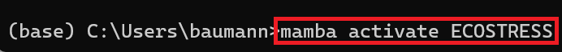

> *This tutorial will show you how to create an Environment on Windows
> operating system.*

# Table of Contents

[What is Miniconda?](#what-is-miniconda)

[Installing Miniconda](#installing-miniconda)

[What is Mamba?](#what-is-mamba)

[Installing Mamba](#installing-mamba)

[What is an Environment?](#what-is-an-environment)

[Creating an Environment](#creating-an-environment)

# What is Miniconda?

Miniconda is a simple tool used to install and manage software packages
and environments. It is a lightweight version of Anaconda, which
includes many different packages in its installation. Miniconda,
however, only comes with Conda and Python, making it easier to download.
We will use Miniconda to install Mamba and create an environment to work
with our ECOSTRESS data.

## Installing Miniconda

1.  There are many different package managers you can use to create an
    environment, so if you are more comfortable using another, you can
    do that. However, for this tutorial we are going to use
    **Miniconda** because it is a lighter version of the traditional
    Anaconda. Start by going to
    <https://docs.anaconda.com/miniconda/miniconda-install/> or
    searching the web for **Installing Miniconda** and clicking on the
    first link.

2.  On the website, click on the link that says **Download the .exe
    installer**.

3.  A new page should show up called **Latest Miniconda installer
    links**. Scroll down and **click the link** next to **Windows** to
    begin the download.

4.  Open your **File Explorer** and go to your **Downloads** folder.
    There should be a download starting with **Miniconda**. Double click
    on it to open it.

5.  A **Miniconda Setup** window should appear. Click **Next**.

6.  The next window will ask you to agree to the **License**
    **Agreement**. Click **I Agree**.

7.  Next, select the **installation** **type**. You can leave this on
    **Just Me** and press **Next**.

8.  Next, you will need to select an **installation location**. It is
    best to leave the destination that they have recommended and just
    press **next**.

9.  The next section is for **Advanced Installation Options**. You can
    leave the default options and select **Install**.

10. A green bar will appear showing the **progress** of the
    installation. Let it finish installing. Once it says **Installation
    Complete** you can click **Next**.

11. In the final window you can select **Finish**.

# What is Mamba?

Conda is a package management system used to install and manage software
and it came with our Miniconda installation. Mamba is a new version of
Conda that works even faster to manage environments. We will install
Mamba so that we can easily create environments for different projects.

## Installing Mamba

1.  Find your **Start Menu**, which is the **search box** at the bottom
    of your screen next to the **Windows logo**.

2.  In the **Start Menu** search for **Anaconda Prompt** and click on
    the application to open it.

>  style="width:3.87323in;height:3.10509in" />

3.  Now that we have the command prompt open, we need to install mamba.
    To do this, type **conda install -c conda-forge mamba** into the
    terminal and press **Enter** to run it.

4.  Let the command run for a bit. Eventually it will ask you to
    **Proceed (\[y\]/n)?** Type **y** into the terminal and **Enter** to
    run it.

5.  You will know it is done installing when you get the message
    **Executing transaction: done**. You now have mamba installed on
    your computer.

# What is an Environment?

An environment is a separate place on your computer where you can
install software and libraries specific to the project you are working
on. This allows you to have multiple projects all with their unique
requirements. We need to create an environment that has all the tools we
need to work with ECOSTRESS data.

## Creating an Environment

1.  In the **Anaconda Prompt** type the command **mamba create -y -n
    ECOSTRESS -c conda-forge python=3.11 jupyter rioxarray hvplot** and
    run it. Here is an explanation of each part of the command:

    1.  **mamba create** is the command to make the environment.

    2.  **-y** confirms changes being made.

    3.  **-n ECOSTRESS** is used to name our environment. In this case
        the environment is being named ECOSTRESS but if you would like a
        different name, you can change it. Just make sure to keep the
        **-n** and not use spaces or special characters in your name.

    4.  **-c conda-forge** sets the channel where mamba will pull the
        packages from.

    5.  For the end of the command, we list all of the **packages** we
        want. Here is a description of each one we will use in our
        tutorial:

        1.  **python=3.12** connects to python, in this case setting it
            to version 3.12.

        2.  **jupyter** allows us to use jupyter notebooks.

        3.  **rioxarray** lets us open rasters.

        4.  **hvplot** will allow us to create maps.

2.  Let the command run. You will know it is **done** when you get these
    instructions on how to **activate** and **deactivate** the
    environment.

3.  Finally, lets activate our environment by typing in **mamba activate
    ECOSTRESS** and running it.

4.  You will know that your new environment has been activated when you
    see the environment name, in this case ECOSTRESS, in parentheses
    before your line of code instead of (base).

Now you have an environment set up to run your code with!
