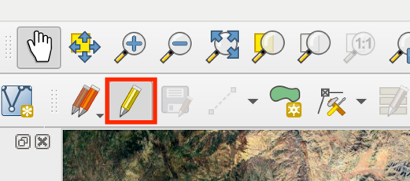

> *This tutorial will show you how to digitize a shapefile in QGIS,
> which can be used to request and download ECOSTRESS data.*

# Table of Contents

[What are shapefiles and why are they useful for working with ECOSTRESS
data?
[1](#what-are-shapefiles-and-why-are-they-useful-for-working-with-ecostress-data)](#what-are-shapefiles-and-why-are-they-useful-for-working-with-ecostress-data)

[Creating a Study Area Shapefile
[1](#creating-a-study-area-shapefile)](#creating-a-study-area-shapefile)

# What are shapefiles and why are they useful for working with ECOSTRESS data?

A shapefile is a vector data format that can store geographic
information in the form of points, lines, or polygons. Study area
shapefiles are typically polygons because they encompass the area you
are interested in studying. Shapefile polygons can come in many
different abstract shapes, which is beneficial when your study site is
not a perfect rectangle. When downloading ECOSTRESS data from the
AppEEARS website or Earthdata Search, you have the option to upload a
shape file of your study area to download data that falls within its
bounds.

## Creating a Study Area Shapefile

1.  In QGIS, make sure you have a satellite **basemap** on. Then, zoom
    into your area of interest. For this tutorial we will look at the
    **Salton Sea** in southern California.

**Tip**: If you do not have basemaps on QGIS, you can get them from
installing the **HCMGIS** plugin. If you do not know how to do that, see
the **Installing QGIS** tutorial under **Preparing QGIS for use with
ECOSTRESS Data.**

2.  Now let’s create a new layer for our shapefile. At the top of your
    screen, select **Layer**, **Create Layer**, then **New Shapefile
    Layer**.

1.  Or you can select this **New Shapefile Layer…** icon in the QGIS
    window.

3.  A new window will appear titled **New Shapefile Layer**. Type in the
    **File name** box to name your shapefile. The name cannot include
    spaces or special characters, and it cannot start with a number.
    Then, press the **three dots …** next to the File name box and
    select a **location** on your computer for the file to be saved.

    1.  It is recommended to make a **folder** to store your shapefile
        documents if you plan to use it to download ECOSTRESS data
        through AppEEARS or Earthdata Search**.**

4.  Next, select the dropdown arrow next to **Geometry type** and select
    **polygon** from the dropdown options.

5.  Then, you must select the **coordinate reference system (CRS)** that
    you would like your layer to be created in. This will define how
    your polygon will be projected onto the map. You can use the
    **default** one provided or click on the **projected globe icon** to
    search for which one you prefer.

6.  If you decide to search for your own by clicking the **projected
    globe icon**, a pop-up window will appear titled **Coordinate
    Reference System Selector**. Here you can use the search bar to find
    your desired CRS either by searching the name, or the EPSG ID. For
    this example, looking at the Salton Sea, we can use **NAD83 / UTM
    zone 11n ESPG:26911**. The easiest way to find this is by typing
    **26911** into the search bar. Then click the arrow drop down next
    to **Projected** under **Predefined Coordinate Reference Systems**.

7.  Then, press the arrow drop down next to **Universal Transverse
    Mercator** and select **NAD83 / UTM zone 11N ESPG:26911**. Once this
    is selected, press the **OK** button to close the window. You should
    now see your new CRS listed in the **New Shapefile Layer** window.

8.  Once all your preferences are set, press **OK** to close the **New
    Shapefile Layer** window. Now, a layer titled **Salton_Sea** will
    show up in your layers pane.

>  style="width:3.38889in;height:1.5428in"
> alt="Graphical user interface, application Description automatically generated" />

**Tip**: If a **Select Transformation** window pops up, select **OK**.

**Tip**: If you get the error **Layer creation failed: Failed to create
file \_\_\_\_\_\_: Read only file system**, re-do the shapefile layer
creation but make sure to press the three dots next to file name to
select a location to save it in!

9.  Make sure the layer is selected in the **Layers** pane and select
    the yellow pencil icon at the top of the window. This will **toggle
    editing** on. Notice if you click it again, the editing tools near
    it will gray out and become unavailable again. For now, let’s toggle
    this **on**.

10. Now let’s begin drawing our polygon. This process is called
    **digitizing**. Select the green polygon icon to **Add Polygon
    Feature**. Your mouse will now change to a circular crosshair icon.

11. Digitize your area of interest by **clicking to create points**
    around the edges. The lines between points are straight, so adding
    more points can add more precision if needed. Also, you may zoom in
    and out throughout this process. If you make a mistake, do not
    worry. Points can be edited later.

12. When you have finished outlining your area of interest, **right
    click** on your mouse or track pad. This will **close** the polygon.
    A new window will appear prompting you to give your polygon a
    feature **id**. For now, we can leave it **NULL** and select **OK**
    because we will only have one polygon, but if you are making
    multiple polygons you may want to number them.

13. Now your polygon should appear filled in on the map. If there are
    any points you messed up on and would like to fix, select the
    **Vertex Tool** to edit them. With the tool selected, hover your
    mouse over the polygon. The vertexes should turn into **red
    circles**.

14. To **move** a vertex, click on it to select it and then click on the
    new location you would like it to move to.

|  |  |  |
|----|----|----|

15. When you are happy with the polygon, select the **Save Layer Edits**
    button.

> Now you have a polygon shapefile of your study area! Make sure to save
> your project before closing.
