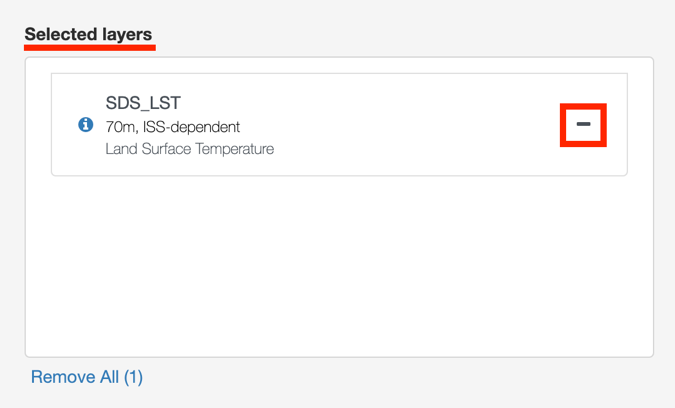
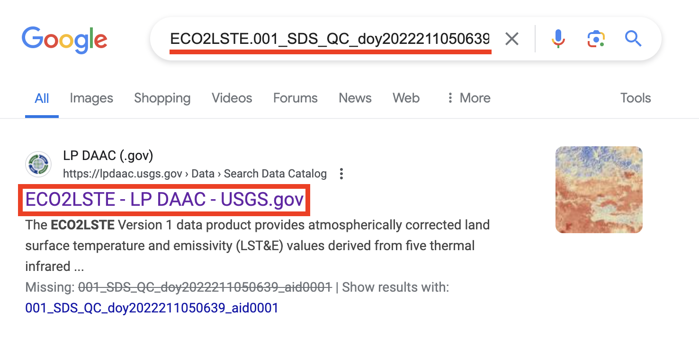

> *This tutorial will show you how to request and download ECOSTRESS
> data from AppEEARS.*

# Table of Contents

[How to Request ECOSTRESS Data from AppEEARS](#how-to-request-ecostress-data-from-appeears)

[How to Download Requested ECOSTRESS Data from AppEEARS](#how-to-download-requested-ecostress-data-from-appeears)

## How to Request ECOSTRESS Data from AppEEARS

1.  Start by going to <https://appeears.earthdatacloud.nasa.gov/> or by
    searching for AppEEARS on the web. Click the green **Sign In**
    button on the top right.

2.  You will be brought to the **Earthdata login** screen. Type in your
    username and password and press the green **LOG IN** button. Once
    you have logged in, it will take you to your **Earthdata Profile
    Home**.

**Tip**: If you do not have an Earthdata login, follow our **Creating an
Earthdata Login** tutorial to make one!

3.  Now that you are logged in, let’s go back to AppEEARS by going to
    <https://appeears.earthdatacloud.nasa.gov/>. You should see your
    username listed next to the person icon in the top right of the
    screen. If it still says sign in, click on that button again and let
    it load to make your username appear. To request data, go to the
    **Extract** dropdown at the top of the screen. Depending on your
    project, you may want to choose area or point, however area is the
    most common so we will do that. Click on **Area.**

4.  The new screen will present you with 3 options- **Start a new
    request**, **Copy a previous request**, or **Upload a request
    file**. For now, we will select **Start a new request**.

5.  The website will now take you to **an Extract Area Sample** page.
    Start by giving your sample a **name** by typing it into the text
    box. For this example, we will be downloading ECOSTRESS data over
    the Salton Sea from 2022, so I will call this **Salton_Sea_2022**.

6.  Next, we need to define the **area** we would like our sample to be
    in. There are a few ways you can do this.

    1.  One way is to select the **pentagon** or **square** icon on the
        map to draw either a **polygon** or a **box** around your area
        of interest. First, **zoom in** on the map to the area you want
        to request data from by using the **plus sign**. Then, select
        one of the tools and either **click** (for polygon) or **click
        and drag** (for box) to define your area of interest.

2.  Another method is to upload a **shapefile** or a **GeoJSON** to
    define your area of interest. This is helpful if you have a specific
    feature or area that you would like the data to be clipped to. In
    the blue dotted line box next to the map, select **click here**.
    This will launch a pop-up where you can browse your files to select
    an upload. Remember, if you are uploading a shapefile, you must
    upload it as a **zipped** **file** containing **.shp**, **.dbf**,
    **.prj**, and **.shx** files. Once you have uploaded it, you should
    see it **appear on the** map. For this example, I will upload a
    shapefile of the Salton Sea that I digitized in QGIS.

**Tip**: If you want to learn how to digitize your own shapefile in
QGIS, follow our **Creating a Study Area Shapefile** tutorial!

7.  Next, select the temporal range for your sample by selecting the
    **Start Date** and **End Date**. To do this, click the **calendar
    icon** to open the calendar, then click the **year** to change it,
    the **month** to change it, and finally select the **day**. For this
    example, we will filter data for January 1st, 2022
    through December 31st, 2022.

**Tip**: If you try to submit your request but you receive a
notification that it is too large, shorten your time period into
multiple smaller chunks and send a request in for each part
individually.

8.  Next, we need **to select the layers** to include in our sample.
    Because we are interested in ECOSTRESS products, start by typing
    **ECOSTRESS** into the box that says **Search for a product**. A
    drop down will then appear with all the related products. Click on a
    product to see its available layers. For this example, let’s start
    by clicking the **ECOSTRESS Land Surface Temperature & Emissivity
    (LST&E)** product.

>  style="width:4.46401in;height:2.73611in"
> alt="Graphical user interface, text, application, email Description automatically generated" />

1.  Once you do this, a new list will appear with the different
    **layers** that that project offers. To add a layer to your request,
    select the **plus button** next to its name. For now, let’s scroll
    down and add the **SDS_LST** layer.

2.  When you click the plus, you will see the layer move over to the
    **Selected Layers Box**. If you accidently add a layer that you no
    longer want, you can select the **minus sign** to remove it from
    your sample.

3.  Let’s add one more layer to our sample from a different product.
    First, click the **x** next to **ECOSTRESS Land Surface Temperature
    & Emissivity (LST&E)** to exit out of that project.

4.  This will return you to the search where you can again type in
    **ECOSTRESS**, however this time click on the product titled
    **ECOSTRESS Cloud Mask**.

5.  There should only be one layer available called **SDS_CloudMask**.
    Click the **plus sign** to add this to your selected layers.

9.  Lastly, we must select our **Output Options**. First, let’s select
    our **File Format** using the dropdown box. For ECOSTRESS, it is
    best to use **GeoTiff**.

10. Then, we need to select the **projection** using the search box. If
    you just click into the box without typing, some options will
    appear. For ECOSTRESS data, let’s use the **Geographic** option.

11. Once all your preferences are set, click the blue **Submit** button
    on the bottom right of the screen.

1.  You will know it has been successfully submitted when you get this
    notification at the top of the screen:

12. Next, go to the tabs on the top and select **Explore**. This will
    take you to a page where you can **Explore Requests**.

13. When you first submit your request, you will see it listed with the
    status as **Queued** until it is picked up to be processed.

14. Once it has been picked up, the status will change to a **loading
    bar** displaying the **percent** of the request that has been
    fulfilled. The time it takes to fill a request depends on how big of
    a request it is. You can leave this screen up if you want to track
    the progress, or you can close it. When the request has been
    fulfilled, you will receive an **email**.

## How to Download Requested ECOSTRESS Data from AppEEARS

1.  Once you have received an email notifying you that your request has
    been fulfilled, go back to
    <https://appeears.earthdatacloud.nasa.gov/> and sign in if needed.
    Then, select **Explore** from the top menu.

2.  In the **Explore Requests** page, you should see your request
    listed. Make sure the **Status** is listed as **Done**. If it is
    not, wait for it to finish processing before continuing.

3.  In the line with your request, select the **download** button. This
    will take you to the **Download Area Sample** page.

4.  At the top of the page, you will see **Supporting Files**. This
    includes a read me, QC information, and metadata. If you want to
    download any of these, click on their name to begin the download.

5.  Below the **Supporting Files** section, you will see all the files
    that you requested listed, along with their size.

6.  Depending on how many files you requested, there may be multiple
    pages of files. Use the **arrow** buttons on the bottom of the page
    to scroll through more pages of files.

7.  Next to the file names are **check boxes**. If you wish to only
    download a **few** of the files requested, you can select the
    checkboxes only next to the file names you wish to download.

1.  Alternatively, if you want to download **all** the files that you
    requested, select the empty box next to **Name** to check all boxes
    on. This is what I will be doing for this example.

8.  Once you have your desired files selected, click the **Download**
    dropdown on the right side of the screen and select **Download
    Files**. This will make the download process begin.

9.  A **progress bar** will appear showing you **how many files** have
    been downloaded out of the total number of files, as well as the
    **percent** of the download that is complete. This may take a few
    minutes, but the time depends on how many files you are requesting
    to download.

10. Once the download is complete, you can find the files by navigating
    to your **downloads folder**. For best practice, put these
    downloaded files in a folder on your computer for future use. Now
    you can use the ECOSTRESS data for your analysis!

**Tip**: Once you have downloaded your files, you can **copy** the
**file name** and **paste** it into Google to get more documentation and
descriptions about the data. Search the name and then click on the first
link to go to the **LP DAAC** site with information about the product
you downloaded.

From there you can get more **information** about the product including
a description, user guide (under documentation, and citation help.

