> *This tutorial will show you how to download ECOSTRESS data from
> Earthdata Search on MacOS.*

# Table of Contents

[What is Earthdata Search?](#what-is-earthdata-search)

[How to Download ECOSTRESS Data from Earthdata Search](#how-to-download-ecostress-data-from-earthdata-search)

# What is Earthdata Search?

Earthdata Search is a
customized search experience that allows users to filter and discover
data. It allows for easy access and use of NASA’s Earth Observing System
Data and Information System (EOSDIS). There is a variety of data
available, including ECOSTRESS data.

## How to Download ECOSTRESS Data from Earthdata Search

1.  Start by going to <https://search.earthdata.nasa.gov/search> or by
    searching for **Earthdata Search** on the Web. In the top right,
    select **Earthdata Login**. This will take you to the Earthdata
    Login page.

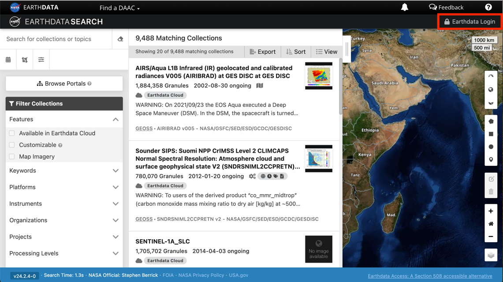

2.  Type in your username and password and select **Login**. This will
    redirect you back to the **Earthdata Search** page.

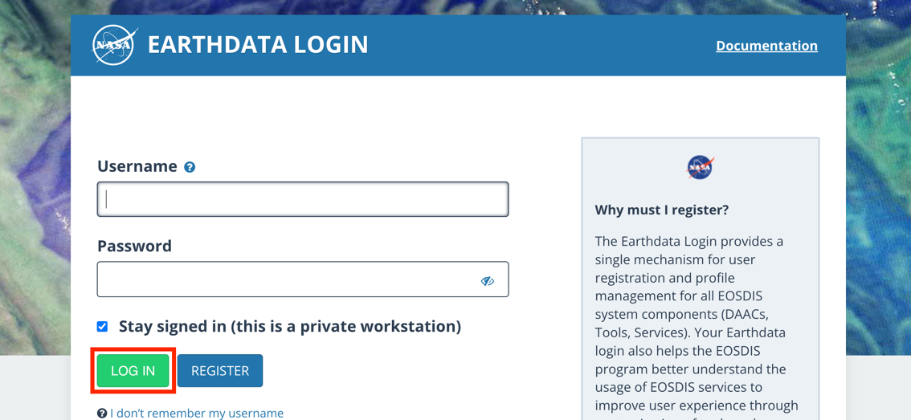

3.  The left most panel of the Earthdata Search window is where you can
    search for data. The preferences that you set in the left panel will
    change what results are shown in the middle panel. Let’s look at
    some of the ways we can do this. First, at the very top there is a
    search bar that says **Search for collections or topics**. This
    allows you to search for different products or key words if you know
    exactly what you are looking for. Select the eraser icon to clear
    your search.

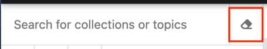

4.  Below that we have three filtering options available. The first
    **Calendar** icon allows you to set start and end dates to filter
    your search. This is called a **Temporal** filter. To confirm, click
    **Apply**.

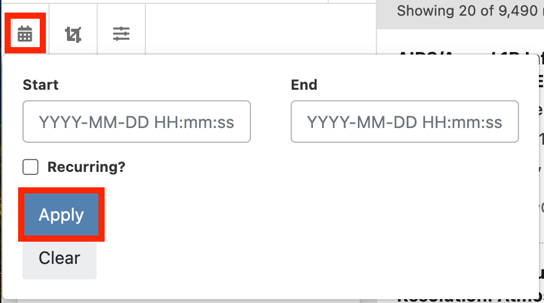

5.  Next, the icon that looks like a crop symbol allows you to set a
    **Spatial** filter around your area of interest. If you click on it,
    a dropdown will appear with different options.

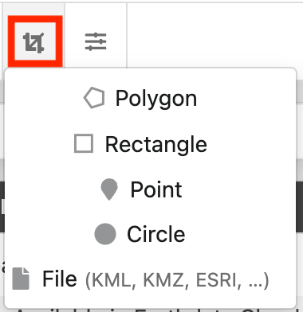

1.  You can select **polygon** to draw a shape with points on the map.
    To finish the polygon, either **double click** or **click on the
    first point**.

2.  You can select a predefined shape (**Rectangle** or **Circle**) or
    **Point** and place it on the map.

3.  Or, you can upload a shapefile by selecting **File**. This will open
    a pop-up that will allow you to **Browse Files** on your computer.
    Make sure the file is in one of the valid formats listed.
    Alternatively, you can drag and drop shapefiles directly onto the
    map.

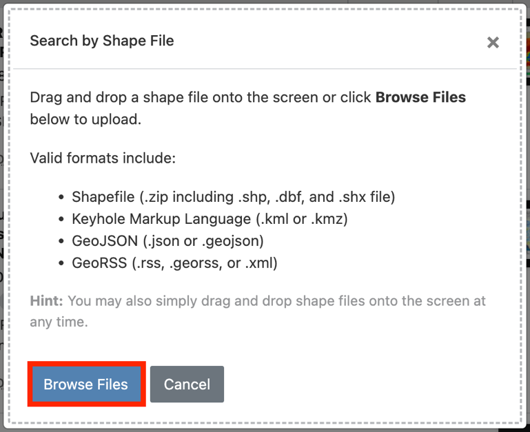

6.  The last icon is the **advanced search icon** this allows you to
    search for Hydrological Units (HUC ID), if that is something you are
    interested in.

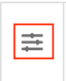
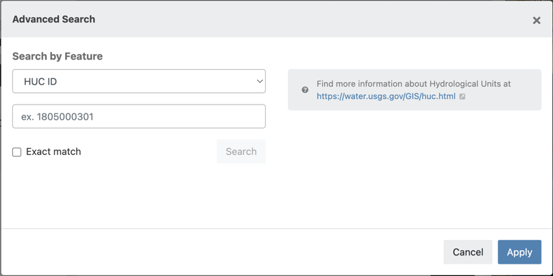

7.  To practice searching for ECOSTRESS data, let’s do a practice
    example. For this example, leave the temporal filter and advanced
    search blank. For the **Spatial** filter, zoom into southern
    California and find the **Salton Sea**. Use the **Rectangle** option
    under the Spatial filter to draw a box around the Salton Sea.

> 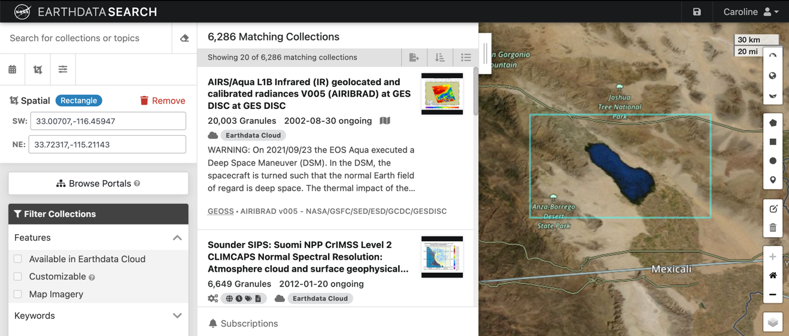 style="width:5.97222in;height:2.55734in"
> alt="Graphical user interface, application Description automatically generated" />

8.  Now let’s look at the **Filter Collections** box. This box allows
    you to select preferences for your search based of criteria in
    different categories including **Keywords**, **Projects**, **Data
    Format**, and so much more. If you are interested in using a variety
    of NASA’s Earthdata, I encourage you to explore and see your
    different options!

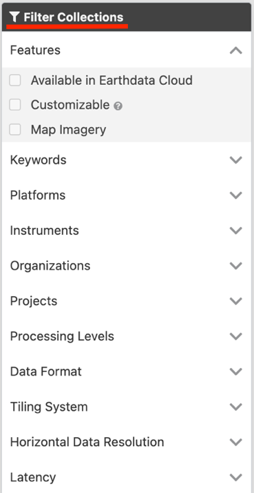

9.  To find ECOSTRESS data, click the dropdown next to the **Projects**
    category in the **Filter Collections** box. In the list of options,
    scroll down to **ECOSTRESS** and click the box next to it to make a
    checkmark appear. You will now see that next to **Projects** it says
    **1 Selected** and the middle panel now shows **ECOSTRESS**
    products.

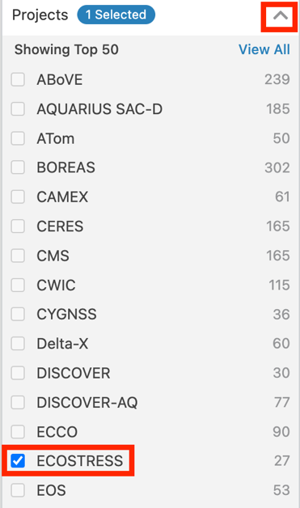

10. You can also filter the ECOSTRESS products by data type. To do this,
    click the dropdown next to **Data Format** and select the box next
    to the data type you prefer. In this case, let’s select **Cloud
    Optimized GeoTIFF (COG)**.

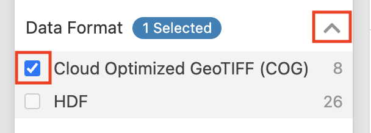

11. Now in the center panel, you will see a list of all ECOSTRESS
    collections with a GeoTIFF data type. You can scroll through the
    options to see what is available in the area you selected. If you
    hover your mouse over the collection, more options will appear.
    Select the **i information** icon to learn more about the
    collection. You can also select the **green plus** to add the entire
    collection to your project to later download.

> 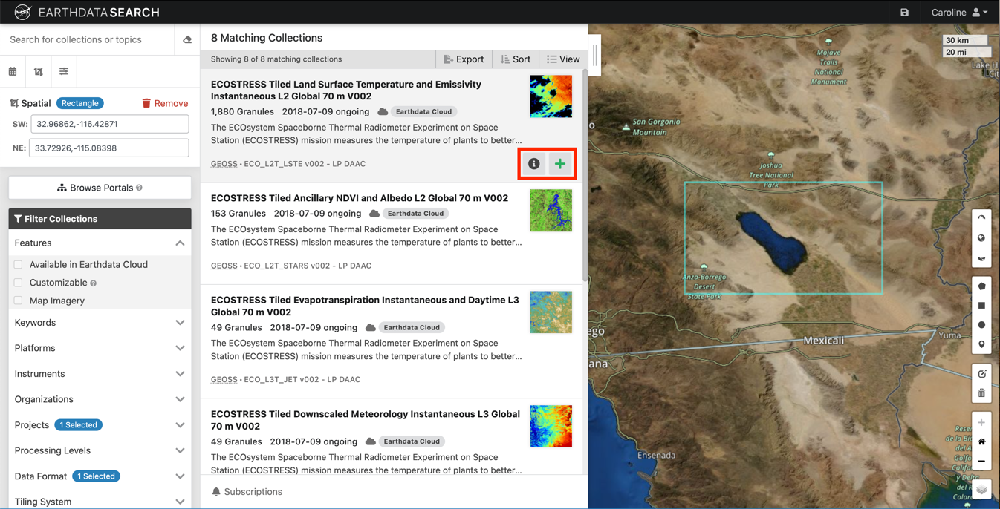 style="width:6.01987in;height:2.4255in"
> alt="Graphical user interface, application Description automatically generated" />

12. For now, let’s just click on the name of the first collection
    listed. It should be **ECOSTRESS Tiled Land Surface Temperature and
    Emissivity Instantaneous L2 Global 70 m V002**.

> 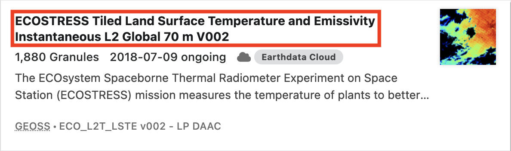 style="width:6.18013in;height:1.84149in"
> alt="Graphical user interface, text, application, email Description automatically generated" />

13. Once you click on the collection, the middle panel will now display
    the **granules** available in that collection that align with your
    search parameters. You will also see a **timeline** at the bottom of
    the screen. The **green bars** on the timeline represent the dates
    when ECOSTRESS data with the specifications you provided is
    available. This timeline is interactive and can be used instead of
    setting a temporal resolution with the calendar icon I showed
    before.

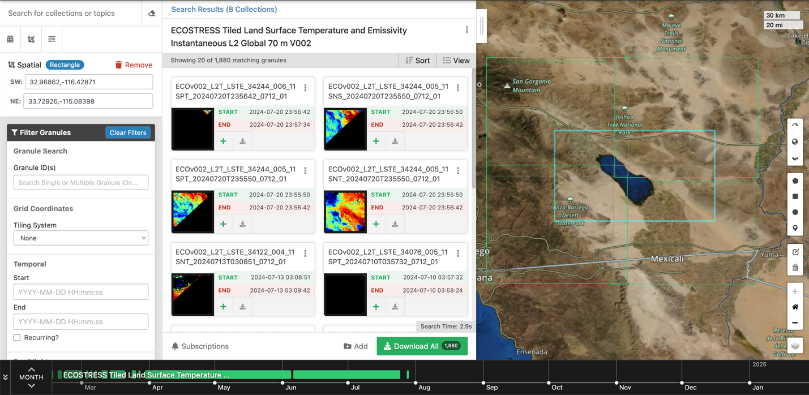

14. To set a temporal filter using the timeline, start by adjusting the
    units. Click the up or down arrows to change the units from **Day**,
    to **Month**, to **Year**. For now, I will set mine to **Year**.

>  style="width:1.09722in;height:0.93056in"
> alt="Graphical user interface, application Description automatically generated" />

15. Next, hold your mouse in the dark gray section above the timeline
    and **drag** across the times you want to filter. Once you let go, a
    **red filter** will be placed over the times you selected. If you
    want to adjust the filter, click and drag the **end lines** of the
    filter to a new position. For now, I want to filter for data from
    the year **2023**.

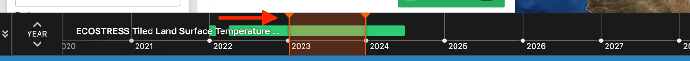

16. Now let’s investigate the granules available. If it is helpful to
    you, you can sort them based on **start date** or **end date** being
    the **oldest** or **newest** by selecting an option under the
    **Sort** dropdown.

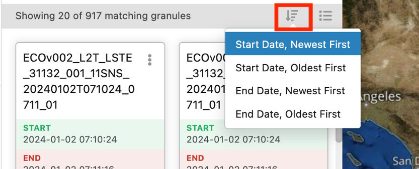

17. Also, if you hover over the **View** icon that looks like bullet
    points, you can choose to view the granules as a **list** or a
    **table**.

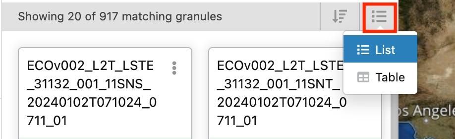

18. Next, **hover your mouse** over one of the granules listed. Notice
    that a **green box** appears around the granule’s description. Also,
    the location of the granule is **highlighted on the map**.

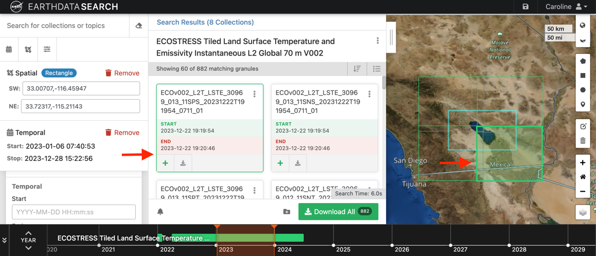

19. In the box with the granule description, there are a few more ways
    you can interact with it. You can select the **green plus** sign to
    **add it to a project** to be downloaded later.

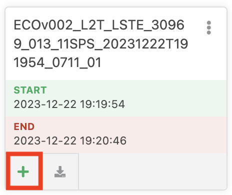

1.  You can also select the **download** button to instantly download
    just that granule. This is especially helpful if you just want one
    file to run tests with.

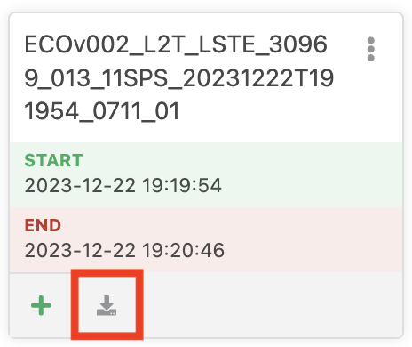

2.  Also, if you click the **three dots** menu, you can either select
    **View details** which will give you more information and metadata
    on the granule, or you can select **Filter granule** to hide that
    specific file from your search.

20. For the sake of our practice example, let’s download a few granules.
    I am going to select the **green plus sign** next to the seven
    granules I found for my area taken on December 14th, 2023
    (**2023-12-14**). You will notice a few things on your screen
    change. First, the green plus signs become **red minus signs** which
    you can click if you want to remove them from the selection. Also,
    the green **Download** button now displays the number of granules
    selected **(7)**. Finally, at the top right of the screen you should
    see a new tab titled **My Project**. To continue, click on either
    the green **Download** button or the **My Project** tab. Both of
    these options will take you to the download window.

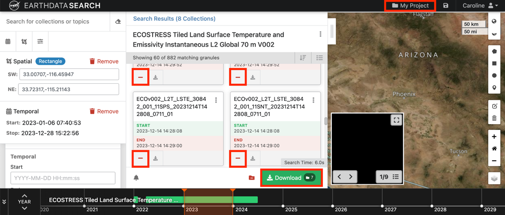

21. In the download window you will have the option to name your project
    by clicking the pen and paper icon next to **Untitled Project**.
    This is helpful if you ever want to revisit this download or share
    it with others. I am going to call this search
    **Salton_Sea_ECOSTRESS**.

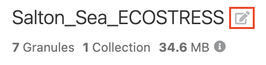

1.  Now when you select your **profile** in the top right and go to
    **Saved Projects** you will see the **Salton_Sea_ECOSTRESS**
    project.

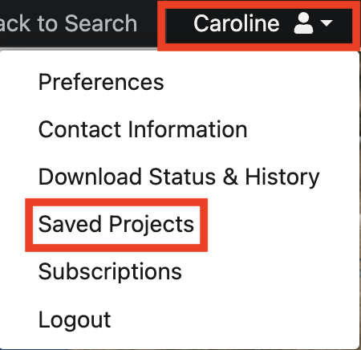

22. The center pane of the download window is where you set **Edit
    Options**. Depending on the product you are downloading, there may
    be more options available. For this example, we will just keep the
    default options. Now press **Download Data** to start downloading.

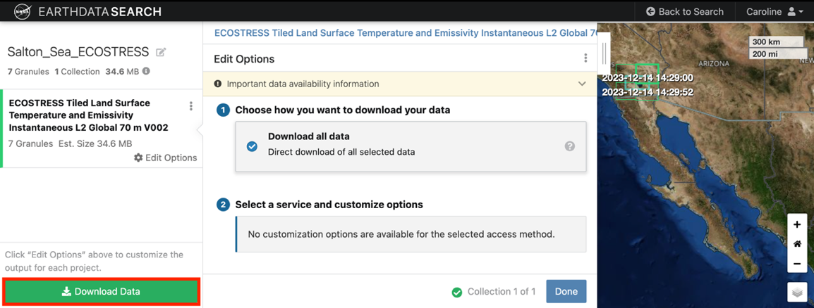

23. Finally, this will take you to a **Download Status** page where you
    can track your orders being processed. Once this is complete, you
    have two options to download the files to your computer.

    1.  One option is to **download files** directly from the **links**
        provided. This will require you to click on each link and
        **specify a download location**. This can be tedious if you have
        many files to download, but helpful if you just want to look at
        a few.

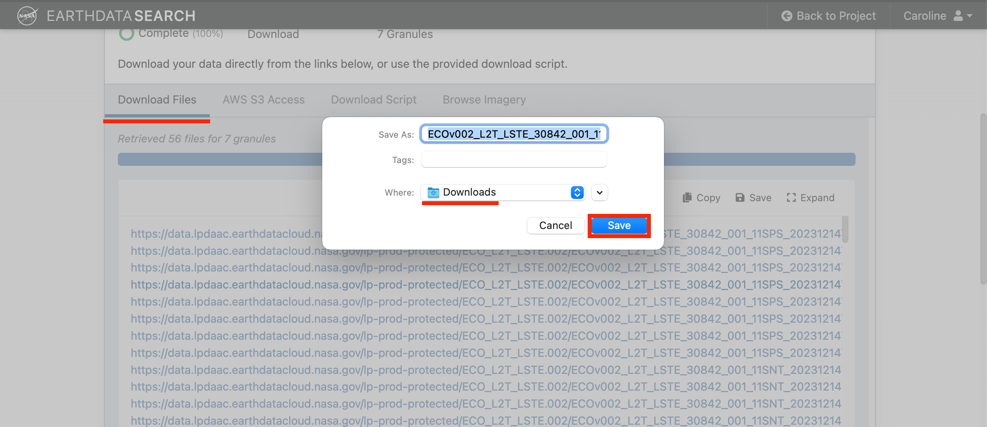

2.  The other option is to use the **Download Script** to download all
    the files at once. To do this, start by saving the script to your
    computer. Click the **Save** button at the top of the **Download
    Script** tab.

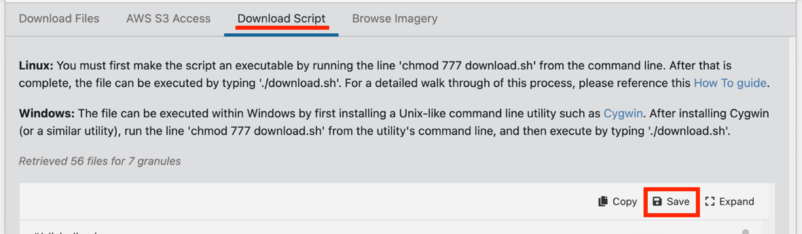

1.  A pop-up will appear asking you where you would like to save the
    script. A good tip is to **create a new folder** on your computer
    for this download because the files will download to the same
    location that your script is in. Then, select this folder as the
    download location and click **Save**.

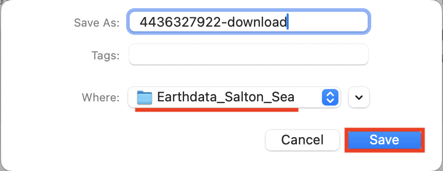

2.  Next, open the **terminal**. You can do this by clicking the
    **magnifying glass** at the top of your screen and typing
    **terminal**, then pressing return.

> 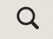 style="width:0.39289in;height:0.28812in" />

3.  In the terminal, we need to connect to the folder that contains the
    saved script. To do this, type **cd** (with a space after it) for
    change directory, followed by the **path to your folder**. The
    easiest way to get the path to your folder is to open to the folder
    in your **finder**, and then **drag and drop** the folder into the
    terminal. Then you will see the path listed. Press **return** to run
    the command.

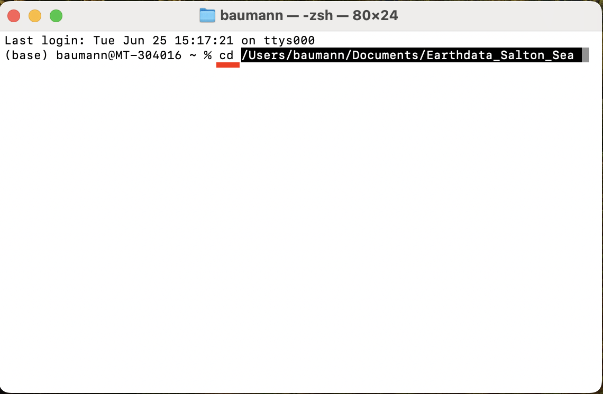

4.  Next, type **chmod 777** into the terminal, followed by the **name
    of the script file** you downloaded. The script file is usually
    named something ending in **download.sh**. Press **return** to run
    it.

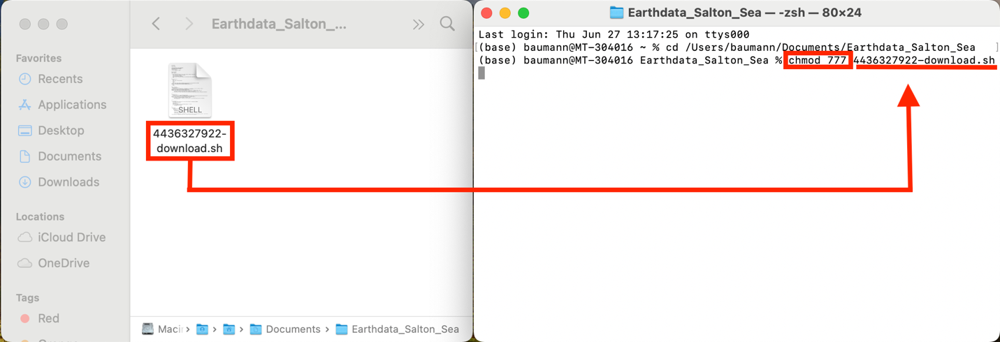

5.  Now, type **./** into the terminal followed by the **name of the
    script file**. Press **return** to run it.

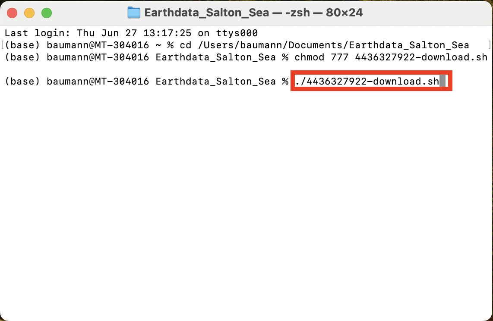

6.  The terminal will now prompt you to enter your **Earthdata Login**
    credentials. Start by typing in your **username** and pressing
    **return**.

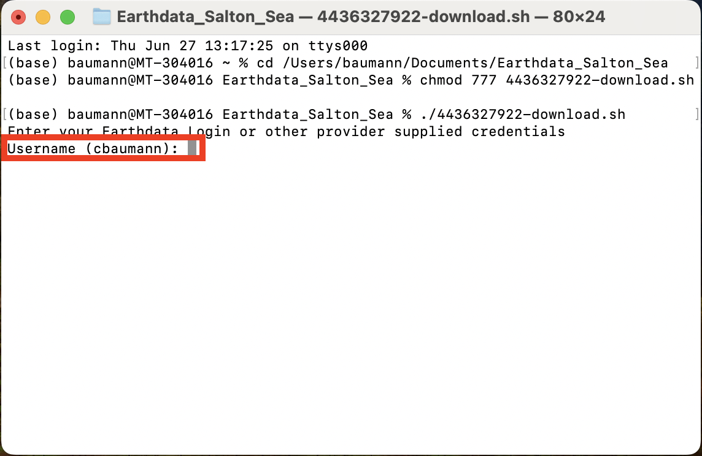

7.  Next, enter your password. Note that the terminal does **not**
    display characters as you type for security reasons. Press
    **return** to run the code.

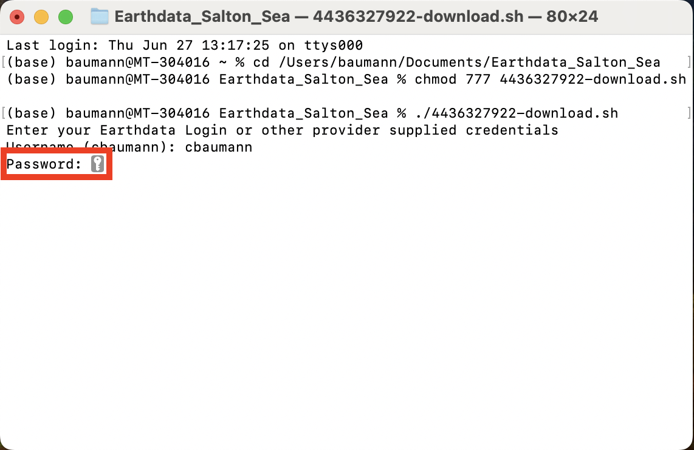

8.  Let the code finish running. You can confirm that the files have
    been downloaded by going to your folder in the finder and confirming
    that they are there. The terminal should look something like this.

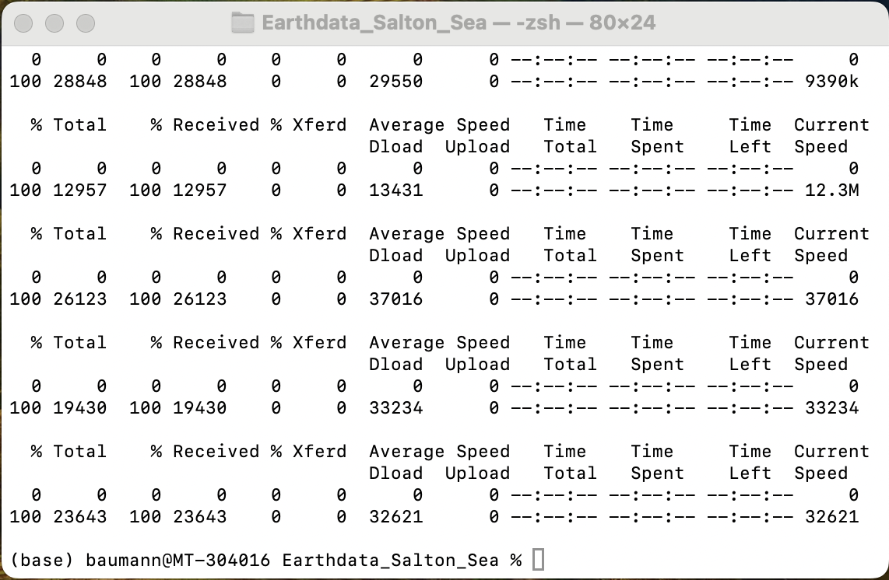

Now you know how to download ECOSTRESS data from Earthdata Search!

**Tip**: You can look at the [ECOSTRESS Naming
Conventions](https://lpdaac.usgs.gov/data/get-started-data/collection-overview/missions/ecostress-overview/#ecostress-naming-conventions)
to help make sense of the files you downloaded!
