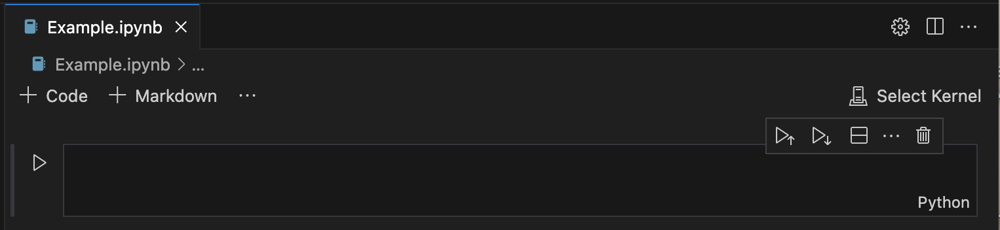

> *This tutorial will show you how to download Visual Studio Code and
> set up a Jupyter Notebook on MacOS.*

# Table of Contents

[What is Visual Studio Code? What is a Jupyter Notebook?
[1](#what-is-visual-studio-code-what-is-a-jupyter-notebook)](#what-is-visual-studio-code-what-is-a-jupyter-notebook)

[How to Download Visual Studio Code [1](#_Toc171338809)](#_Toc171338809)

# What is Visual Studio Code? What is a Jupyter Notebook?

Visual Studio Code is a
free software that is used to write and edit code. We will use visual
studio code to write Python code in a Jupyter Notebook. A Jupyter
Notebook is a tool that allows you to write code and view outputs in a
single document, allowing for an interactive coding process.

## How to Download Visual Studio Code

1.  Start by going to <https://code.visualstudio.com/> or by searching
    the web for **Visual Studio Code**. Once you get to the site, click
    the blue **download** button.

>  style="width:5.88548in;height:3.03077in"
> alt="Graphical user interface, application Description automatically generated" />

2.  In your **downloads folder** you will find a zipped visual studio
    code file. **Double click** on the file to unzip it.

>  style="width:0.80587in;height:0.95833in"
> alt="A picture containing text, electronics Description automatically generated" />

3.  A new icon will appear of the Visual Studio Code logo. **Double
    click** to open the application.

>  style="width:0.68056in;height:0.81525in"
> alt="Text Description automatically generated" />

4.  Once the application is open, let’s install some extensions to allow
    us to use Python and Jupyter notebooks in Visual Studio Code. On the
    left side of the application, look for the **extensions** icon and
    **click** on it.

5.  A new **panel** should open prompting you to search for extensions.

>  style="width:2.22222in;height:3.7094in"
> alt="A screenshot of a phone Description automatically generated with low confidence" />

6.  In the search bar, type **Python**. Once you have found the
    extension, click the blue **install** button. It should say
    “installing” for a moment, and then it will be installed.

**Tip**: If you do not have Python installed on your computer, follow
the **Installing Python** tutorial to get it set up.

7.  Now, let’s do the same thing to install the Jupyter extension. In
    the search bar type **Jupyter**, find the extension, and click the
    blue **install** button.

>  style="width:3.44178in;height:1.00441in"
> alt="Graphical user interface, text, application Description automatically generated" />

8.  Now that everything is installed, we can start a new Jupyter
    Notebook. If you already have a folder on your computer with data,
    you can get connected to it by selecting **File \> Open Folder…**
    which will open a finder window where you can navigate to your
    project folder and select **Open**.

9.  You will know it opened successfully if the **Explorer** tab now
    displays the folder name and the files in it.

10. Now that your folder is open, let’s create a Jupiter Notebook file.
    Hover over the name of your folder and some icons will appear next
    to it. Select the **New File** icon.

>  style="width:3.56944in;height:0.44444in"
> alt="Text Description automatically generated" />

11. Once selected, a new blank text entry box should appear under your
    folder name. Type in the name of your new file and make sure to give
    it the extention **.ipynb**. This will ensure that your new file is
    a Jupyter Notebook.

>  style="width:4.07644in;height:0.97961in"
> alt="Graphical user interface, text, application Description automatically generated" />

12. Hit enter and your new Jupyter Notebook will be created. In the main
    panel, your new Jupyter Notebook should end up looking like this:

13. Finally, we need to set the **Python interpreter** and **Kernel** to
    the correct environment. Start by pressing **Cmd+Shift+P** to open
    the Command Palette. Type **Python: Select Interpreter** and click
    on it.

14. A new list will appear with your **interpreter options**. You can
    select whatever environment you would like, but I am going to select
    the one I set up to work on this data which I called **ECOSTRESS**.

**Tip**: If you do not have an environment set up on your computer, or
do not know what an environment is, follow the **Creating an
Environment** tutorial to get it set up.

Now your Visual Studio Code is set up for writing Python code for
ECOSTRESS data!
