> *This tutorial will show you how to contribute to the ECOSTRESS
> tutorials GitHub by forking a repository, cloning it to your local
> machine, committing your suggested changes, pushing your changes back,
> and submitting a pull request. This allows for greater collaboration
> among the broader ECOSTRESS community. This tutorial is for MacOS
> computers.*

# Table of Contents

[Prerequisites](#prerequisites)

[What is a forking?](#_Toc181108352)

[Creating a Fork](#creating-a-fork)

[What is a cloning?](#what-is-a-cloning)

[Cloning the Forked Repository](#cloning-the-forked-repository)

[What is a committing?](#_Toc181108356)

[Making and Committing Edits](#making-and-committing-edits)

[What does it mean to push changes?](#what-does-it-mean-to-push-changes)

[Pushing Changes to the Forked Repository](#pushing-changes-to-the-forked-repository)

[What is a pull request?](#what-is-a-pull-request)

[Creating a Pull Request](#_Toc181108361)

# Prerequisites

To follow along with this tutorial, you must have a GitHub account. If
you do not have one, you must create one before proceeding with this
tutorial. Also, make sure you have Visual Studio Code downloaded on your
computer. If you need help installing it, go to
<https://ecostress.jpl.nasa.gov/tutorials> and follow along with the
provided tutorial.

# What is a forking?

Forking creates a personal copy of someone else’s repository on your
GitHub account. Think of a repository like a project folder containing
all relevant documents. We need to fork when we want to make changes to
a repository to later send back for review. The forked repository will
live in your personal GitHub and will be separate from the original
repository that you got it from. Any changes made in the original will
not change your fork unless you explicitly update it.

## Creating a Fork

1.  Start by **logging in** to your GitHub account and going to the
    **repository** that you would like to modify. You can view all the
    different ECOSTRESS tutorials repositories at
    <https://github.com/orgs/ECOSTRESS-Tutorials/repositories>. For this
    tutorial, I am going to use the ECOSTRESS-Single-Cloud-Mask
    repository because I found a typo there that I want to suggest a fix
    for.

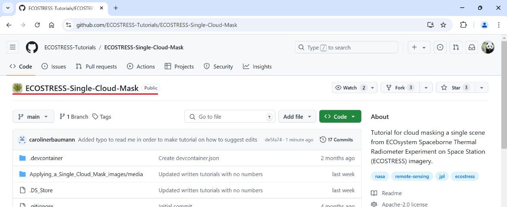

2.  Once you are on the repository page, click **Fork** in the top
    right.

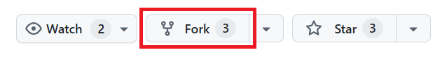

3.  Click on the dropdown under **Owner** and select your GitHub
    username. It may automatically be selected for you. If you do not
    see it as an option, make sure you are logged into GitHub.

**Example**: My username is CarolineBaumannJPL

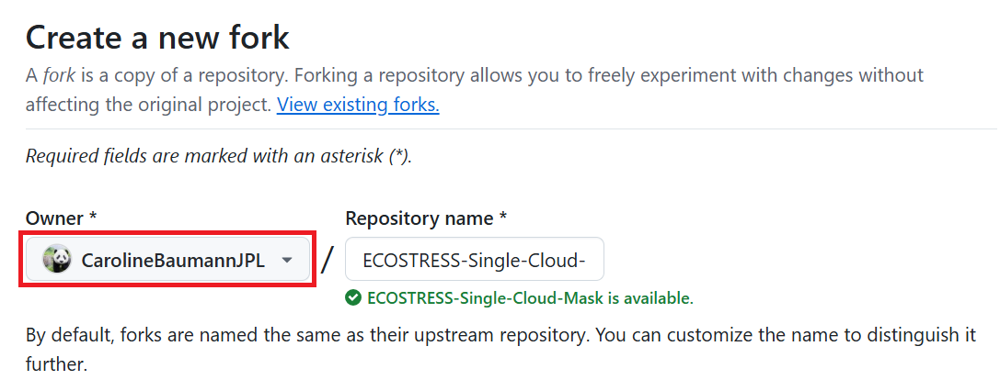

4.  By default, the **Repository name** will be listed as the same name
    as the repository you are trying to fork. If you would like, you can
    modify this name. However, most of the time we can leave it as is.

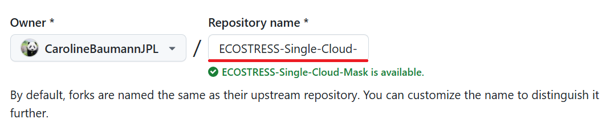

5.  The **Description** will also be the same as the description of the
    repository that you are forking. If you want to change it, you can
    do that now.

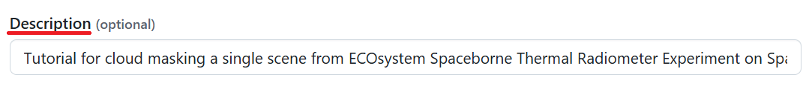

6.  By default, **Copy the main branch only** is selected. Most of the
    ECOSTRESS tutorials only have a main branch, so it is okay to
    **leave this as is**. However, if there are sub-branches that you
    would like to include, you may choose to uncheck this box.

7.  Finally, click the green **Create Fork** button. This will take you
    to your new forked repository.

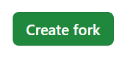

# What is a cloning?

Cloning is the process of copying a repository from yours or someone
else’s GitHub to your local machine (i.e. computer). This makes it easy
to work with locally for testing, editing, and development. The changes
you make in your cloned repository will only exist on your computer
until you chose to push them back to GitHub. We need to clone the
repository we just forked so we can make edits and later suggest them
back to the original project.

## Cloning the Forked Repository

1.  Start by opening the **terminal**. You can do this by clicking the
    **magnifying glass** spotlight search icon, typing terminal, and
    pressing enter.

>  style="width:0.44444in;height:0.33333in" />

2.  We need to set the directory to the place on your computer where we
    want the clone of this repository to exist. For me, I want this in
    the documents folder, so I am going to copy the path to my documents
    folder.

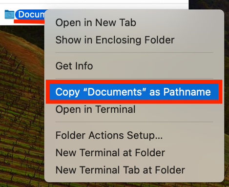

3.  Then, in your terminal, type **cd** followed by the path to where
    you want the clone to be saved. Press **Enter** to run it. Leave the
    terminal window open.

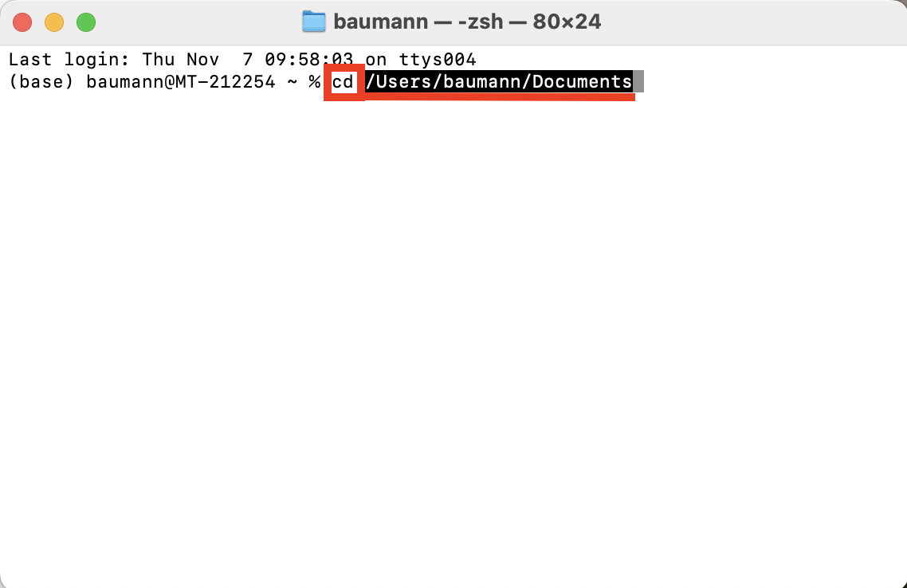

4.  Next, go to your browser and make sure you are on the forked
    repository page that you just created. Click the green **\<\> Code**
    button.

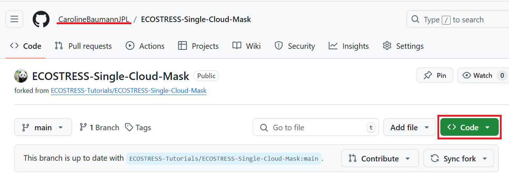

5.  In the drop down you will see three options: **HTTPS**, **SSH**, and
    **GitHub CLI**. HTTPS is the most beginner friendly, so we are going
    to use that. However, you can use one of the other options if you
    are more comfortable with them. While on the **HTTPS** option, click
    the **clipboard** icon to **copy** the URL.

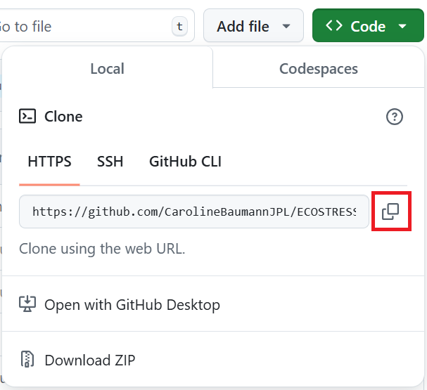

6.  Go back to your terminal window, type **git clone,** and paste the
    URL you copied from GitHub. Press **Enter** to run it. Now you
    should have a clone of the repository on your local machine.

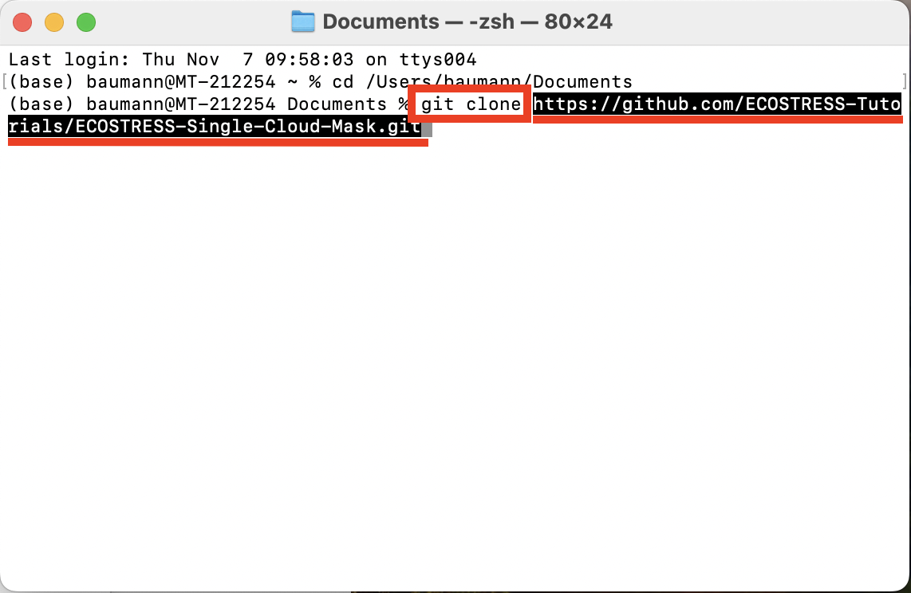

7.  Next, lets change the directory to our new cloned repository by
    typing **cd** followed by the path to the repository folder on your
    computer. Press **Enter** to run it.

> **Example:**
>
> 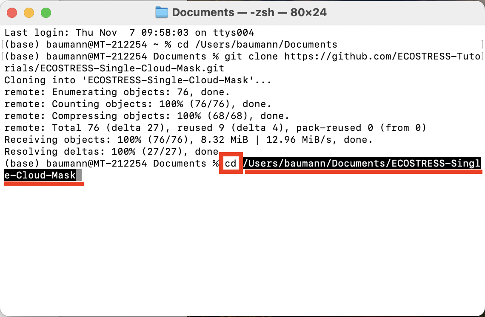 style="width:5.03694in;height:2.08796in"
> alt="Graphical user interface, text Description automatically generated" />

8.  Finally, we need to let the terminal know what our GitHub username
    and email is. First, type the command **git config user.name "Your
    User Name"** into the terminal, replacing “Your User Name” with
    whatever your user name is. Press **Enter** to run.

**Example:**

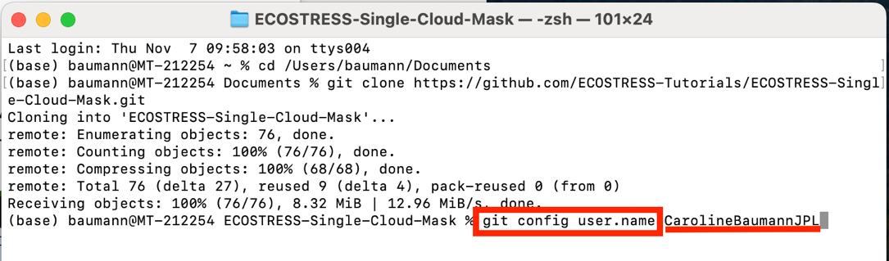

9.  Then, type **git config user.email "your-email@example.com"** and
    replace “your-email@example.com” with whatever email you created
    your account with. Press **Enter** to run.

**Example:**

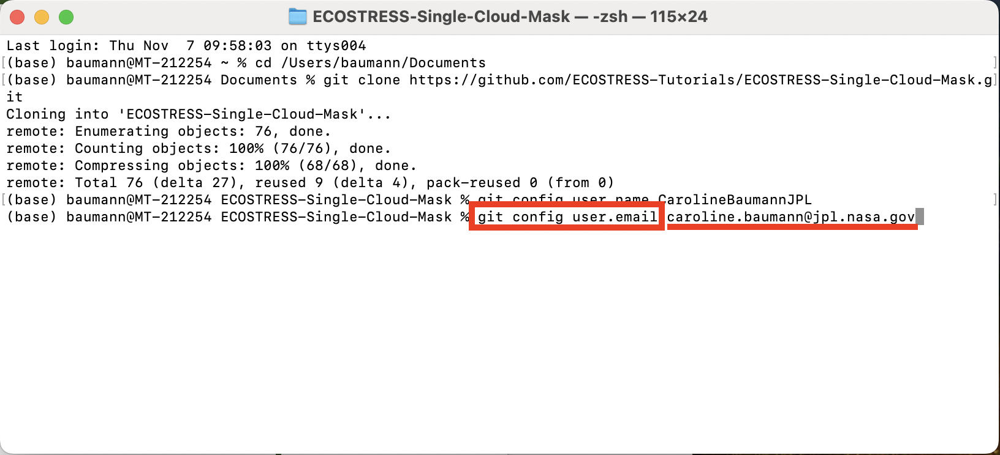

# What is a committing?

Now that we have a clone of our forked repository, we can make whatever
edits we want. Once these edits are made, we need to commit them, or
save the changes to our local repository. Every time we commit changes,
we leave a message describing what we edited. This allows us to track
changes and versions of our work so we can go back if we ever need to.

## Making and Committing Edits

1.  Open **Visual Studio Code**. Select **File \> Open Folder…** and
    open the folder of the cloned repository that you made in the
    previous section.

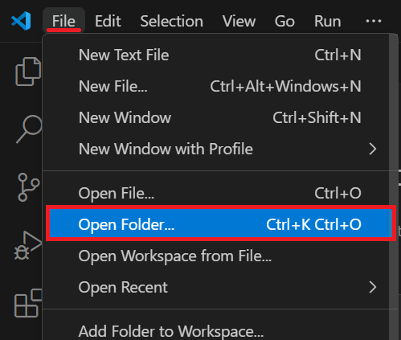

2.  Once the folder is open, you will see all the files from that
    repository in the **EXPLORER** pane. Click on the file you want to
    edit to **open it**. For example, I noticed a typo in the Read Me
    file, so I am going to click on that one to open it.

1.  Alternatively, you can add an entirely new file to the folder by
    hovering your mouse over the folder name in the EXPLORER tab and
    selecting the **New File** icon.

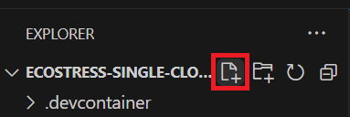

3.  Make the **changes** that you would like in the document you opened.
    You can open and edit as many documents as you would like. Once you
    are done making edits, make sure to select **File \> Save** to save
    your edits. The next step will not work unless your edits are saved.

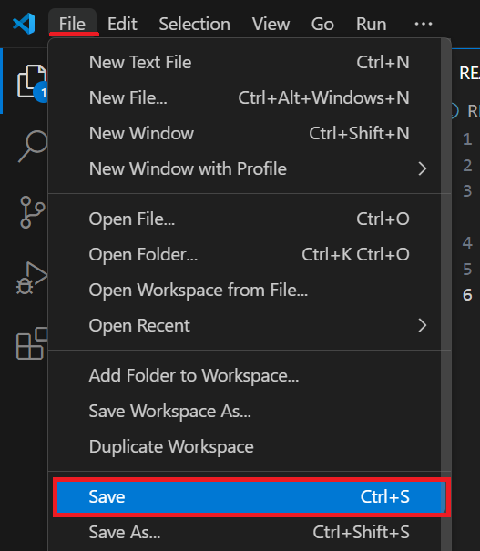

**Tip**: If you have unsaved edits in any of your files, a blue number
will appear next to the file icon in the top left with the number of
saves that need to be made. Once you have saved everything, this number
will disappear, and you know you are good to proceed to the next step.

4.  Once all your edits are saved, a blue circle with a number will
    appear on the **Source Control** icon. The number will correlate
    with the number of changes you made. Click on the Source Control
    icon to open the **Source Control panel**.

5.  In the new panel, look for the dropdown that says **Changes**. If
    you hover your mouse over this, a plus sign will appear. Click the
    plus sign to **Stage** your changes. Staging your changes just means
    that you want to include them in the next version of the project. We
    stage our changes to later be committed back to the repository.

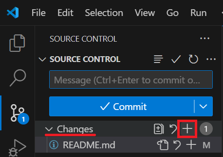

1.  Alternatively, if you want to stage just **some** changes, but not
    all, you can hover over individual files under **Changes** and
    select the plus sign to add just that file’s changes to the **Staged
    Changes**. In my case, I only made one change, but if you made
    multiple changes, this is how you can decide which ones you want to
    commit.

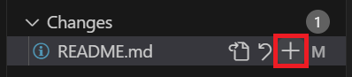

6.  At the top of the panel, you should see a box that says **Message**.
    Here is where you need to type your commit message. A commit message
    is just a brief description of the changes that you made in order to
    remind you and others of what is different in this version compared
    to the previous one. Based on your change, type in your brief
    message.

**Example:**

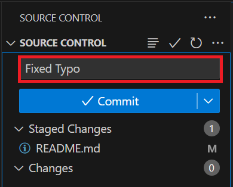

7.  Next, press the blue **Commit** button. By pressing commit, you are
    saving your staged changes as a new version in your local cloned
    repository.

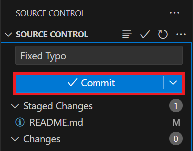

# What does it mean to push changes?

Previously, we forked a repository to our own GitHub, cloned it to our
computer, and made and committed edits to the clone on our computer.
Now, we need to push our changes, which means we save the changes we
made on our local computer to our forked online GitHub repository.

## Pushing Changes to the Forked Repository

1.  There are multiple ways to push changes to a forked repository. One
    way is using the command **Git Push**, however if it is just you
    making changes, the easiest thing to do is just press the blue
    **Sync Changes** button in Visual Studio Code that shows up when you
    commit changes.

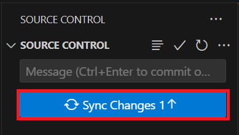

2.  You may get a pop up warning saying that **This action will pull and
    push commits from and to “origin/main”.** You can press **OK**.
    Furthermore, if a pop-up shows up asking you to log into GitHub, you
    can follow those steps to do so.

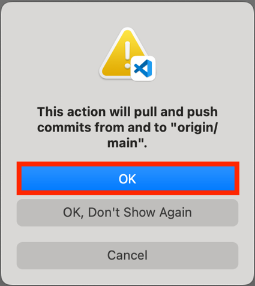

3.  Open a **web browser** and go to the **GitHub** page with your
    **forked** repository. Double check to make sure that **all
    changes** were made.

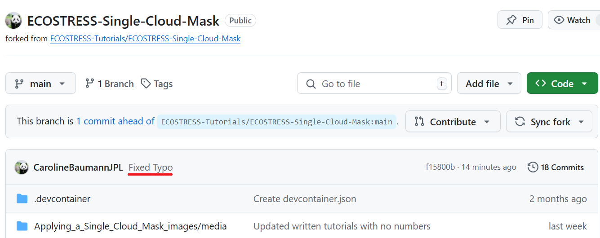

# What is a pull request?

The final part of this tutorial is creating a pull request. A pull
request is a way to suggest changes back to the original repository that
we created our fork from. This allows the owners of the ECOSTRESS
tutorials repository be able to review your changes and decide if they
want to implement them in the main repository.

## Creating a Pull Request

1.  In a browser window, open the **forked repository** on your
    **GitHub** account.

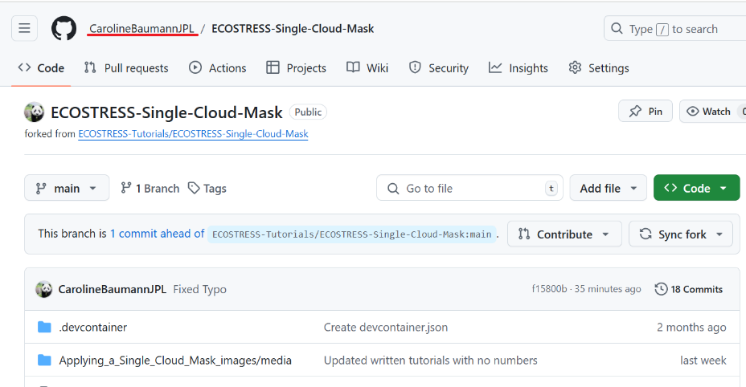

2.  You should see a message at the top that has a dropdown that says
    **Contribute**. Click the dropdown and then select **Open Pull
    Request**.

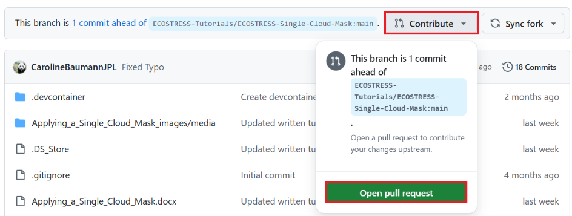

1.  Alternatively, at the top of the page, **click** on the option that
    says **Pull requests.** On the new page, click the green **New pull
    request** button.

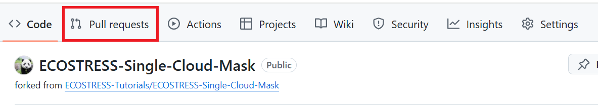

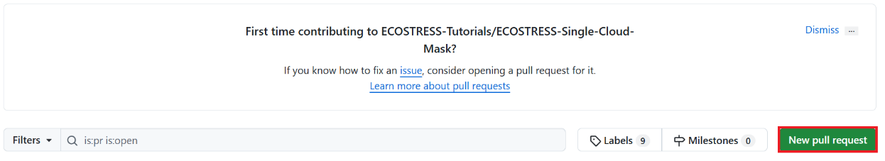

3.  A new page titled **Open a Pull Request** or **Comparing changes**
    should appear. At the top, you will see two sections with dropdowns.
    The first represents the main tutorial repository where you want to
    suggest changes. Make sure the **base repository** listed is the
    original one that you first created your fork from. The next drop
    down should say **base: main**, with “base” for the repository and
    “main” for the branch. If you are working with a branch **other than
    main**, you should have that listed after the colon.

**Example:**

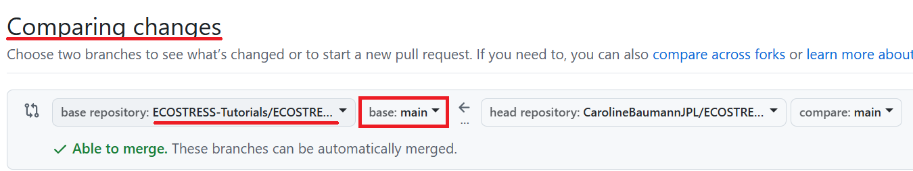

4.  The second section represents your forked repository that you made
    changes to. The first drop down should say **head repository** with
    your personal forked repository listed after it. The second drop
    down should say **compare: main**. It is most likely that your
    branch will be **main**, but if you are working with another one,
    make sure to select the correct one from the dropdown.

**Example:**

5.  The first text box is the **title** of your request. This should
    **automatically** generate based on your **commit message**, however
    if you want to change it you can do that now.

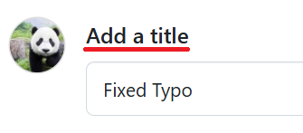

6.  Under **Write** you should see a text box that says **Leave a
    comment**. Here you can type out a longer and more detailed message
    of the changes you made.

**Example:**

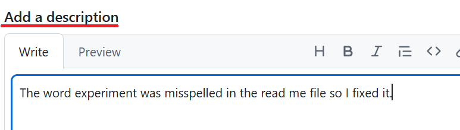

7.  When you are done, press the green **Create pull request** button.

> 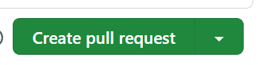 style="width:3.16904in;height:0.6399in"
> alt="Graphical user interface Description automatically generated with low confidence" />

Now you have made your pull request! Your suggestions will be reviewed
by the current owner of the ECOTRESS tutorials GitHub. Thank you for
contributing!
