> *This tutorial will show you how to visualize a raster image in QGIS,
> create a layout for it, and export it.*

# Table of Contents

[What is a Layout? [1](#what-is-a-layout)](#what-is-a-layout)

[Visualizing a Raster in QGIS
[1](#visualizing-a-raster-in-qgis)](#visualizing-a-raster-in-qgis)

[Designing a Layout in QGIS
[6](#designing-a-layout-in-qgis)](#designing-a-layout-in-qgis)

[Exporting a Layout in QGIS
[20](#exporting-a-layout-in-qgis)](#exporting-a-layout-in-qgis)

# What is a Layout?

A layout is a workspace where you can arrange maps and other elements
such as titles, legends, and scale bars. Layouts can be used to create
maps that can then be exported and shared with others. Processed
ECOSTRESS images can be brought into GIS and visualized, and then put in
layouts to export the results.

## Visualizing a Raster in QGIS

1.  Create a new project in QGIS by opening the application and
    selecting **Project** \> **New**. Make sure to **save** and **name**
    your new project.

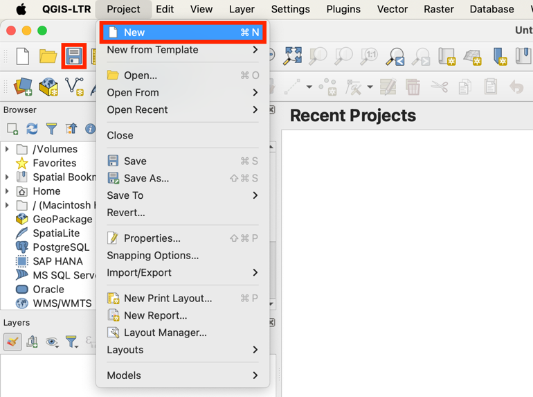

2.  At the top, select **HCMGIS** \> **Basemaps** and add your desired
    base map. For this example, I am going to use **Google Satellite**.

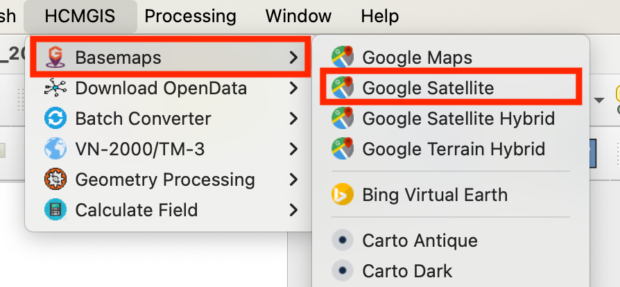

**Tip**: If you do not have the HCMGIS plugin installed, see the
**Installing QGIS** tutorial for instructions on how to get basemaps set
up!

3.  Under the browser tab, click the **Home** folder dropdown. Navigate
    to the location on your computer where the raster image that you
    would like to visualize is stored.

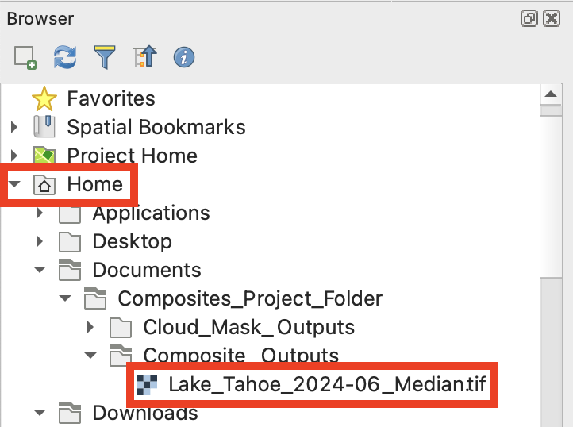

**Tip**: If you do not have an ECOSTRESS image to be visualized, see the
**tutorials** on downloading data from AppEEARS, filtering images,
applying cloud and QC masks, and creating composites. For this example,
I am using an image I created by downloading ECOSTRESS LST data from
**AppEEARS**, applying a **cloud mask** to the images, and then creating
a **composite** of them. However, you can use any image you may like for
this tutorial.

4.  When you find it, **right click** on it and select **Add Layer to
    Project**. Alternatively, you can **click and drag** to add it to
    the map.

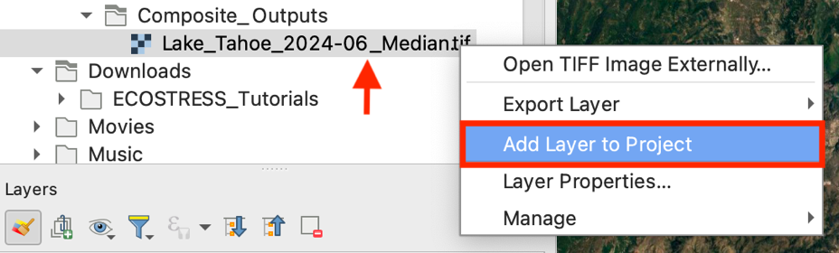

5.  Now that it is in the map, go the **Layers** pane and right click on
    the layer you added and select **Zoom to Layer**.

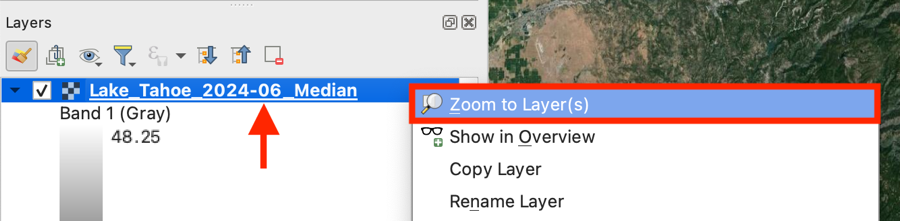

6.  Next, select the layer you added. Then select the **paintbrush**
    icon to open the **Layer Styling** pane.

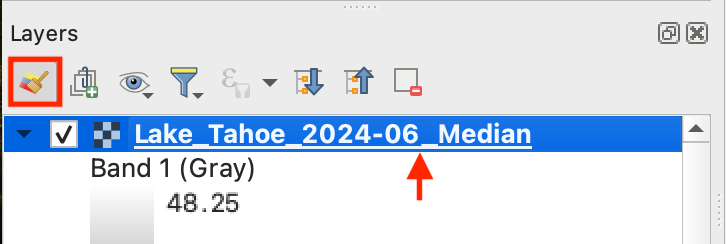

7.  To change the raster from black and white to color, go to the
    **Layer Styling Pane** and click on where it says **Singleband
    gray** and select **Singleband pseudocolor** from the dropdown.

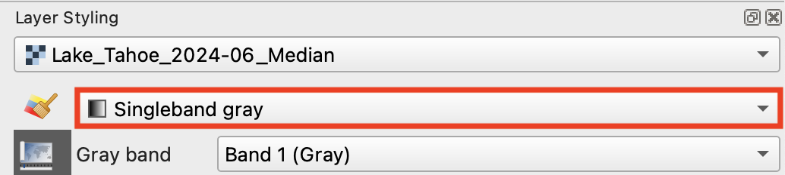

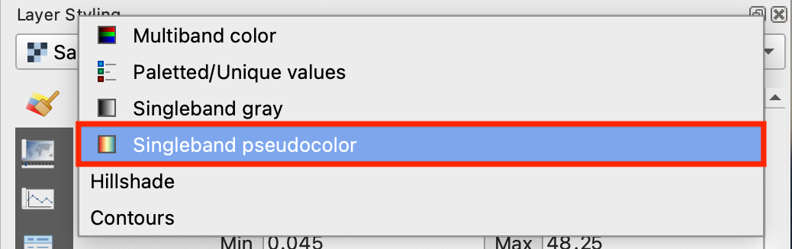

8.  Select the **color ramp** drop down. You can select from one of the
    options listed or create your own. For this example, I am going to
    choose the **spectral** color ramp.

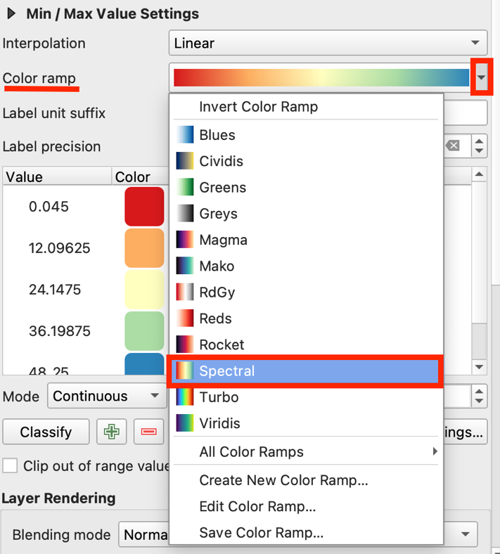

1.  It is good practice to have **lighter** colors representing
    **lower** values, and **darker** ones representing **higher**
    values, because it is more logical to most viewers. In order to
    change the color ramp so that the red represents higher
    temperatures, and the blue represents lower ones, select the **Color
    ramp** dropdown and select **Invert Color Ramp**.

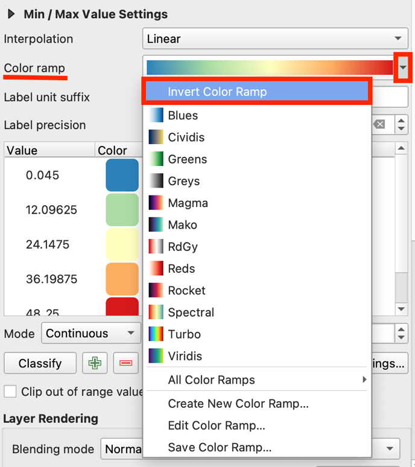

9.  You can also choose a **Blend mode**, if you would like some of the
    basemap features to show through your raster layer, by clicking on
    the drop down and selecting an option. For this example, I am going
    to choose the **Hard Light** blending mode.

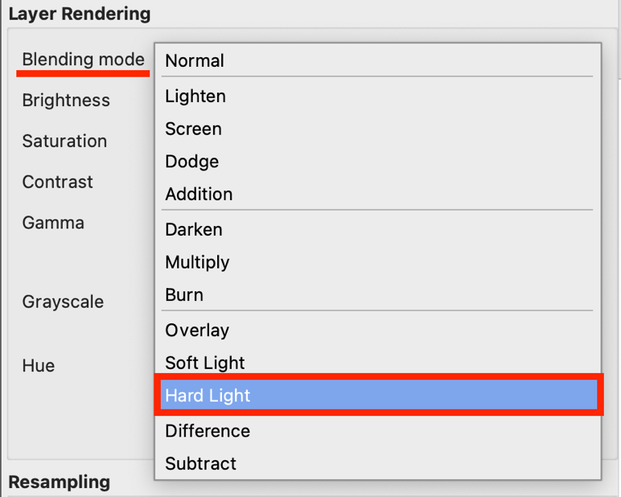

10. Lastly, click on **Legend Settings…**

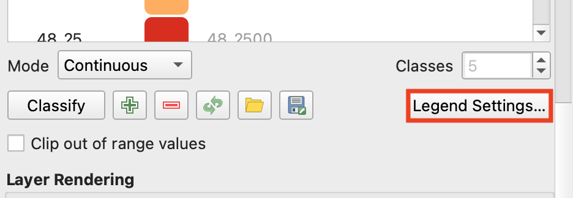

1.  Find where it says **Number format** and click on where it says
    **customize.** Change where it says **Round to** to a lower number.
    I only want whole numbers, so I am going to set this to **zero**.

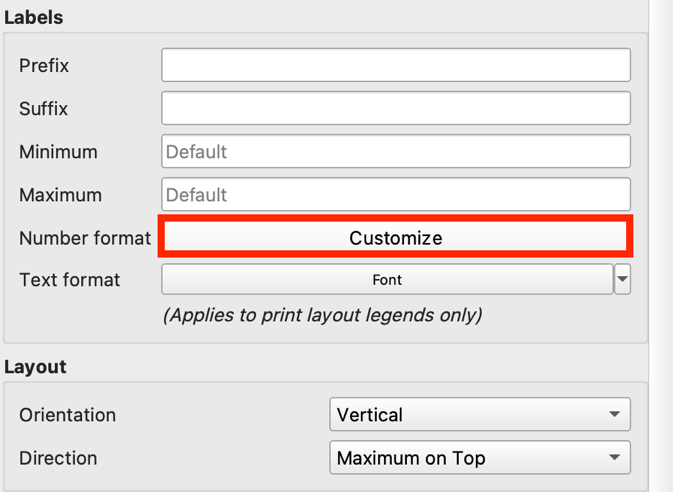
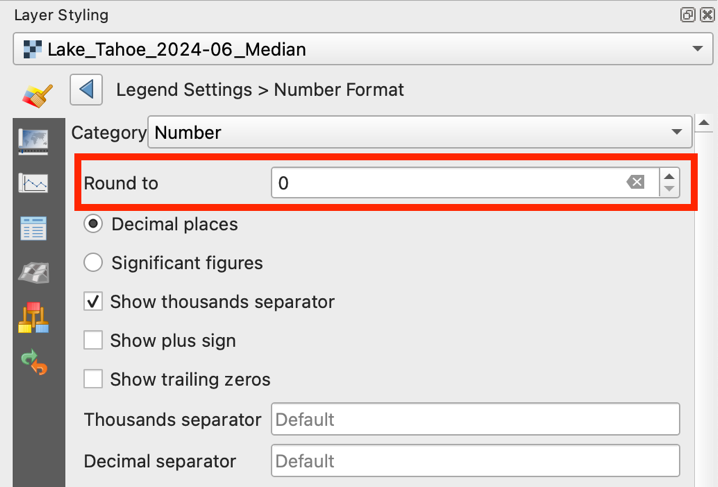

Now you have your raster image visualized in QGIS!

**Example:**

## Designing a Layout in QGIS

1.  With your QGIS project open, select the **New Print Layout** button
    at the top left.

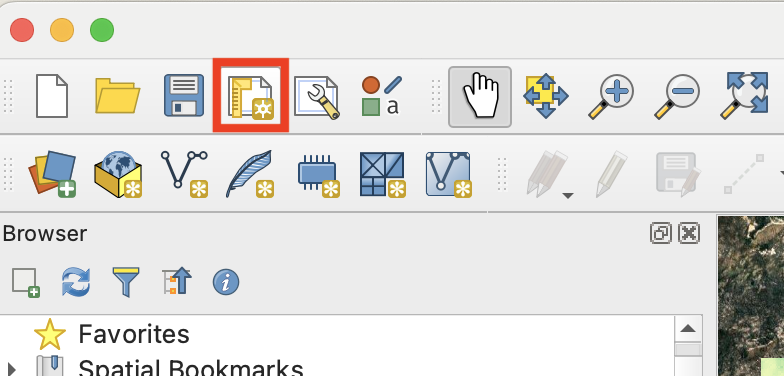

2.  A pop-up will appear asking you to **name** your print layout. Give
    it a name and select **OK**.

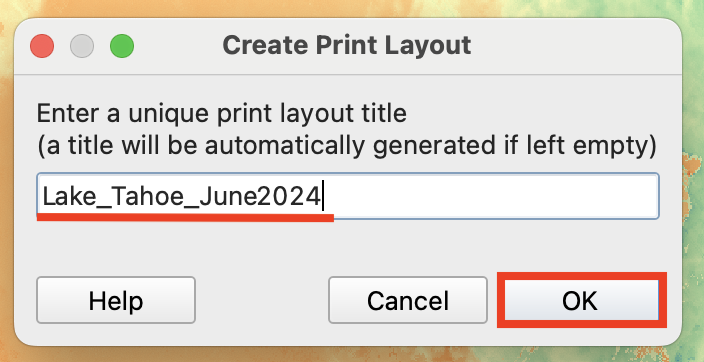

3.  A new layout window will open. You can use your mouse to scroll in
    and out of the page.

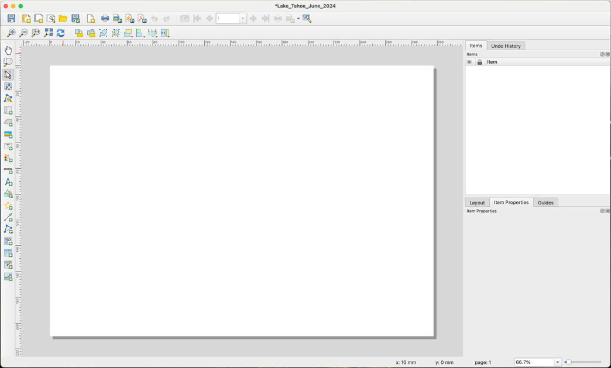

4.  On the right side of the window, click on **Item Properties**. Then
    click on the **layout page**. Some options will appear to adjust the
    page.

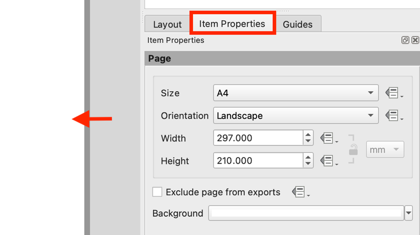

1.  You can adjust the **Size** of the layout by selecting an option
    from the dropdown or creating a custom size. For now, I am going to
    choose **letter**.

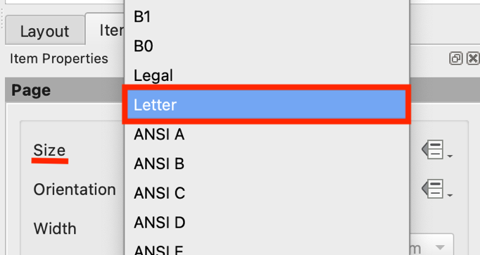

2.  You can also change the **orientation** of the page, using the
    dropdown, to better suit the shape of your map. For now, I am going
    to leave it **Landscape**.

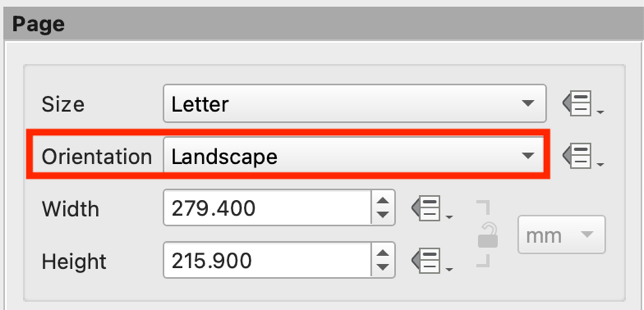

3.  Finally, if you want a different **Background** color, you can click
    the drop down and change it. For this example, I am going to leave
    it **white**.

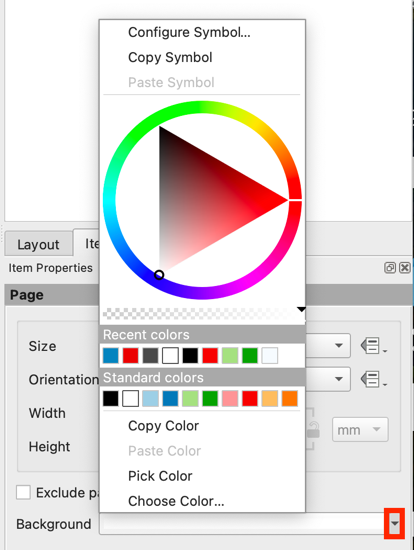

5.  Next, let’s add some **guides** so that the map will be even on our
    page. Guides are lines that we can set up at different parts of the
    page to help us **align** items. The lines will show up on the
    layout, but **will not be visible** when you export it. Select the
    **Guides** tab. Use the **green plus** icon to add different guides
    to the page, either horizontally or vertically.

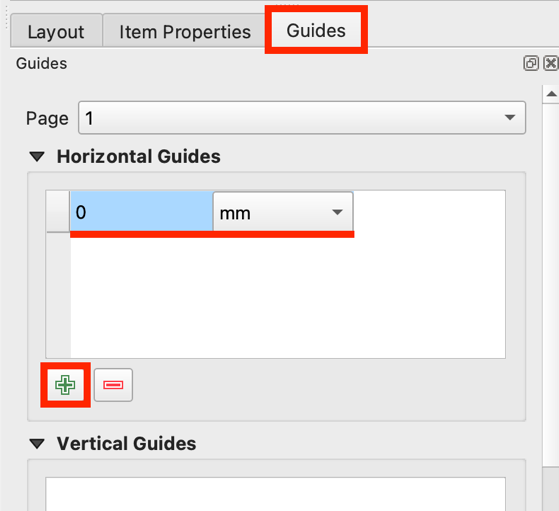

1.  Once you add a guide, you can change the **length**, by typing in a
    number, and **unit**, using the dropdown. For this project, I am
    going to add lines to create a **one-inch** margin on all sides of
    the page. Because I am using a letter size layout, the margins I
    inputted are **horizontal at 1 and 7.5 inches and vertical at 1 and
    10 inches.**

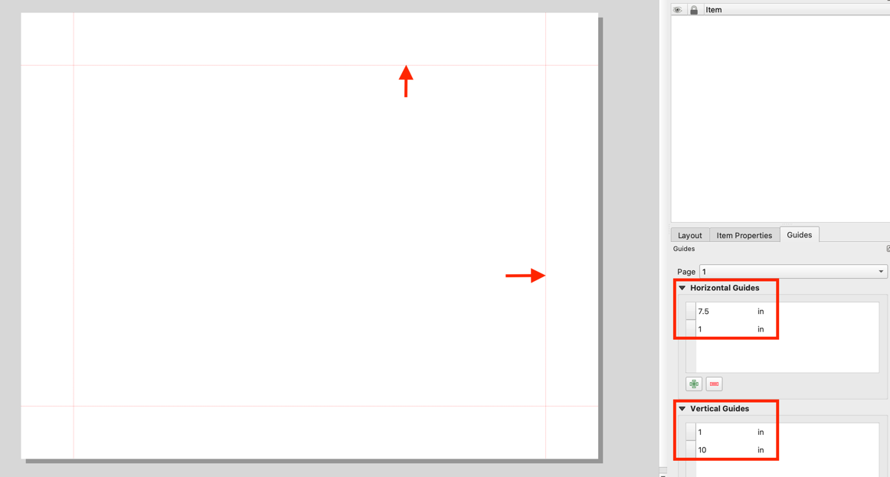

6.  Now that our page is set up, let’s add our map. On the left side of
    the window, select the **Add Map** button. Then **click and drag**
    to add the map to the layout. You can use the **guides** you set to
    help center the map on the page.

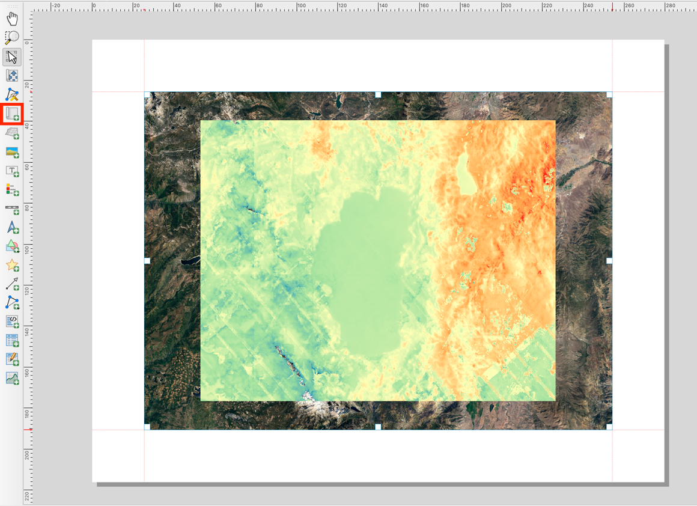

7.  Once the map is on the page, select the **Move item content**
    button. This will allow you to **click and drag** the map around, as
    well as use your map to **zoom** in or out. When you are satisfied
    with how it looks, click the Move item content button **off**.

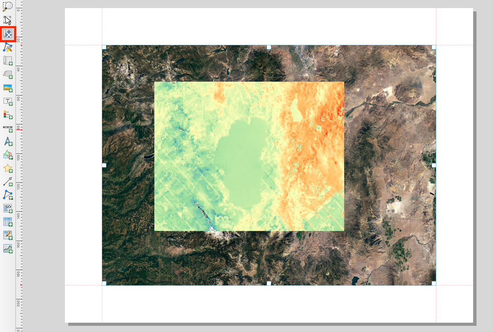

1.  Sometimes it is difficult to adjust the map exactly how you like it
    in the layout. As an alternative to using the Move item content
    tool, you can start by just adjusting your map in the **main QGIS
    project** (not the layout). Once you like how it looks, go back to
    the layout, select the map you inserted, and select **item
    properties**. Then, select the first icon with the **orange arrow**
    at the top. This tool will **Set the Map Extent to Match Main Canvas
    Extent**. The map in your layout will now look like the map in your
    project canvas.

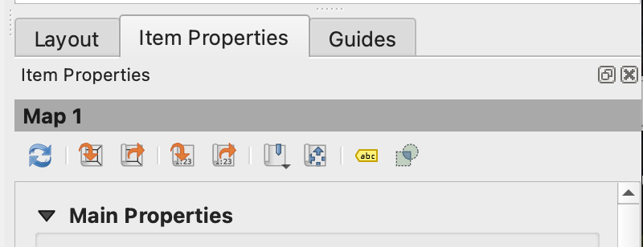

8.  Now, let’s add a title to our map. On the left tool bar, select the
    **Add Label** button that looks like a text box. **Click and drag**
    the box wherever you would like your title to go.

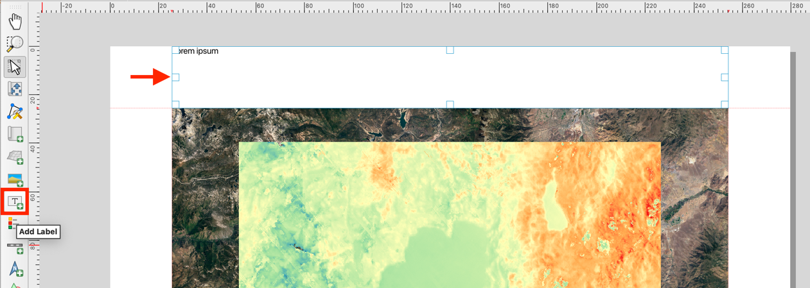

1.  Unlike many other software, you cannot click directly into the text
    box to change the text. Instead, select the text box, go to the
    **Item Properties** tab, and under **Main Properties**, use the text
    box there to type whatever you would like the title of your map to
    be.

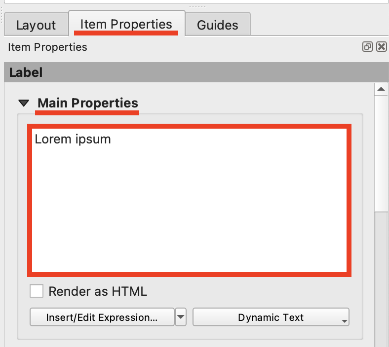

2.  Then, scroll down to where it says **Font** and click on it to open
    the font settings. Here you can change the **text font, style, size,
    and color**. For my title I am going to make it Arial font, Bold,
    size 30 points, and gray. Once this is set, click the **blue arrow**
    to go back to the Main Properties.

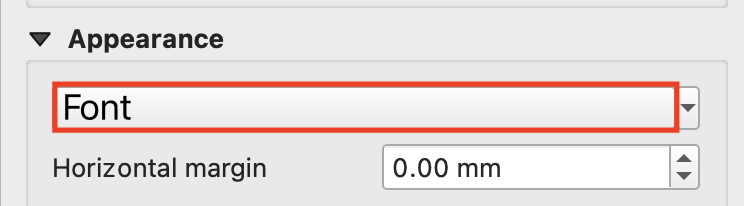

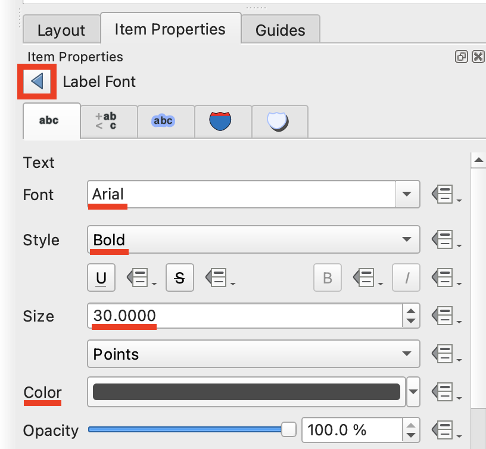

3.  Scroll down to where it says **Appearance**. Here you can adjust the
    alignment. I am going to select **Center** for the Horizontal
    alignment and **Middle** for the Vertical alignment.

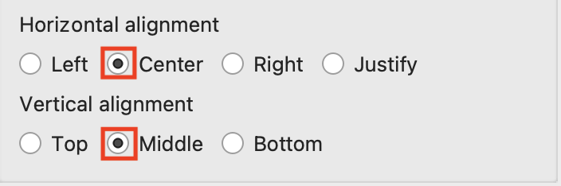

9.  Next, let’s add a legend. Select the **Add Legend** tool from the
    left toolbar and click and drag to put the legend onto your layout.
    Then, we can make it look nicer.

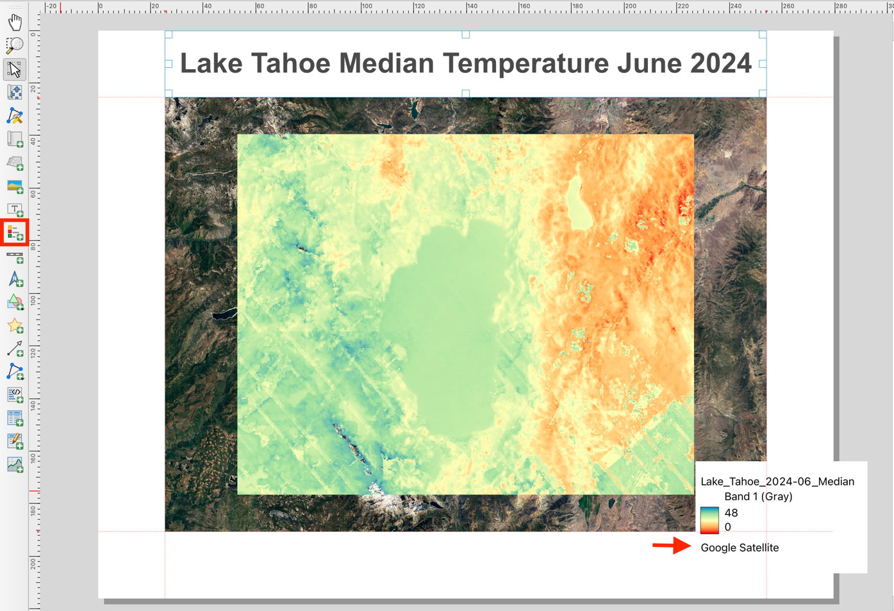

1.  The name of the raster does not really make sense for viewers. To
    fix this, go back to the QGIS project, and under the **Layers**
    pane, right click on the raster layer and select **Rename**. Now,
    name the layer whatever you would like it to appear in the legend.
    For example, I am naming mine **Degrees Celsius**. When you go back
    to the layout, it may take a minute for the new name to update.

2.  I also do not want **Band 1 (Gray)** and **Google Satellite** in my
    legend. To fix this, select the legend in the layout window and go
    to the Item Properties pane. Scroll down to where it sats **Legend
    Items**. Click the box that says **Auto update** off.

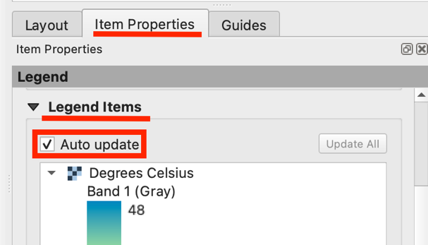

1.  Now, you can **select** the parts of the legend that you want to
    remove and select the **red minus** button to remove them.

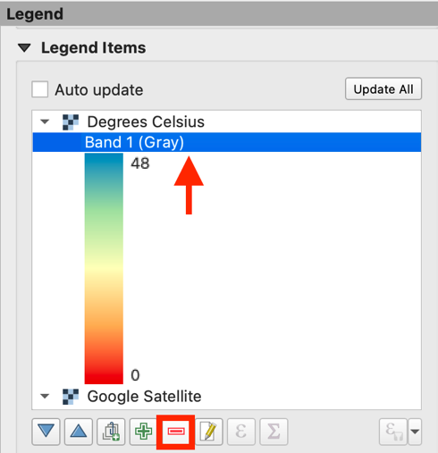

3.  Next, lets adjust the legend text. In the Item Properties pane,
    select the **Fonts and Text Formatting Dropdown**. Then, under
    **Subgroup Headings** select where it says **Subgroup font**.

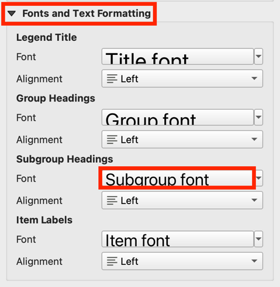

1.  In the new Text Format section, you can adjust the **text font,
    style, size, and color**. This will change the style of the raster
    layer name. I am going to set mine to Arial font, Bold, size 9
    points, and gray. Then, click the **blue arrow** to go back to the
    Fonts and Text Formatting section.

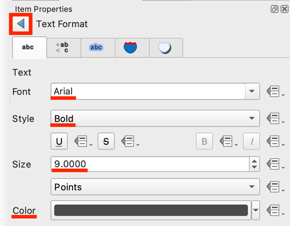

2.  Also under **Subgroup Headings**, you can adjust the alignment using
    the dropdown. I am going to set mine to **center**.

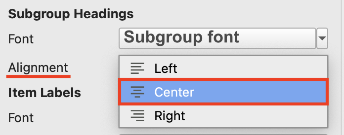

4.  Now let’s change how the color ramp symbol looks, since I do not
    want it so squished. In the Item Properties pane, select the
    **Symbol** dropdown. Here you can change the symbol width and
    height. I am going to set mine to **6mm wide and 26mm tall**. I am
    also going to click off the **Draw stroke for raster symbols**
    option because I do not want a box around my symbol.

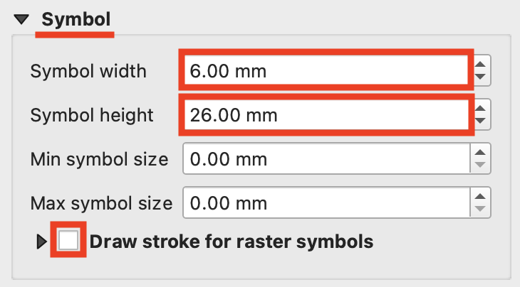

5.  We can also adjust where the symbol is aligned. To do this, scroll
    up to the **Main Properties** section and select the dropdown next
    to **Arrangement**. I am going to keep mine to have symbols on the
    **left** side.

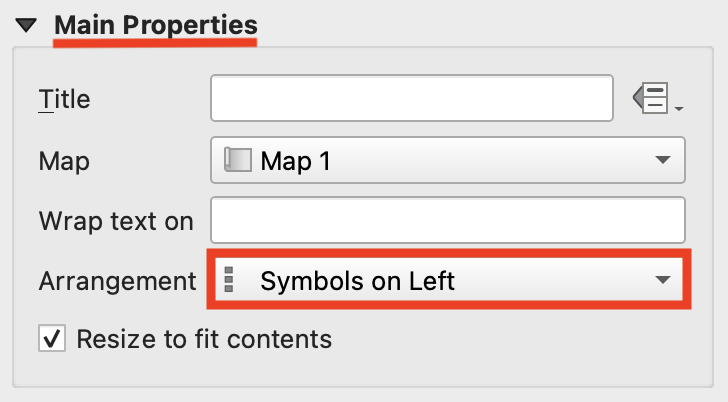

6.  Then, lets adjust the label text. Scroll back down to **Fonts and
    Text Formatting** and select the box that says **Item font.** Again,
    you can adjust the **text font, style, size, and color.** I am going
    to set mine to Arial, Gray, and size 12 points. Then, using the blue
    arrow to go back to the Fonts and Text Formatting settings, I am
    going to change the alignment to **left** if it is not so already.

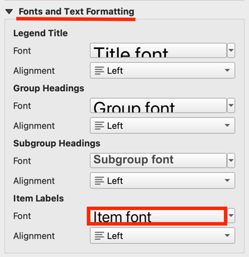
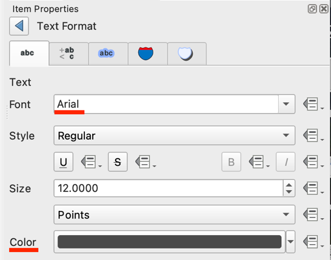

7.  Move the legend to wherever you would like it to be on the layout.
    If you scroll down in the legends pane, you can change the **color**
    and **opacity** of the **Background.** You can also choose to add a
    **Frame** and change its color. For now, I am going to leave the
    **background white** and add a **light gray frame**.

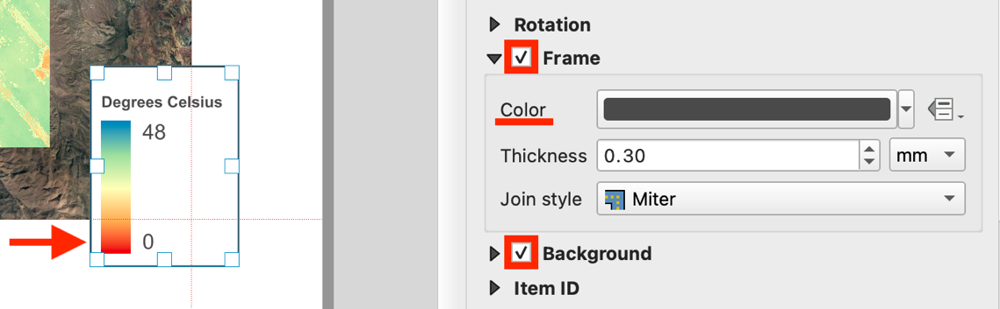

10. Now, let’s add a scale bar. Click the **Add Scale Bar** button on
    the left tool pane and click and drag to add it to your map.

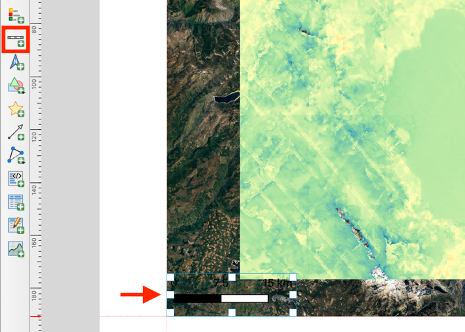

1.  With the scale bar selected, go to the **Item Properties** pane and
    look for the **Main Properties** section. Then, select the dropdown
    next to **Style** and browse the different options. I am going to
    select **Line Ticks Up**.

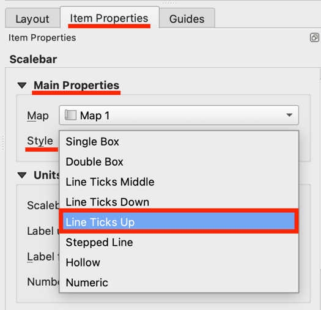

2.  You can also change the **Units** by selecting the drop down next to
    **Scalebar units** and changing it to whatever you would like. For
    this project I am going to change it to **Miles**.

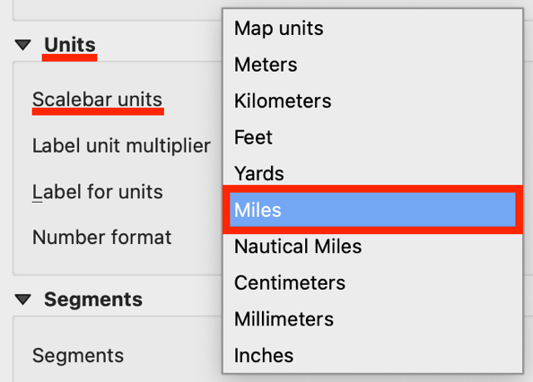

3.  Then scroll to the **Segments** section and find where it says
    **Fixed width**. You can change this to however long you want your
    scale bar to be. I am going to set mine to **5**. You can also
    change the **Height** which I set to **2**.

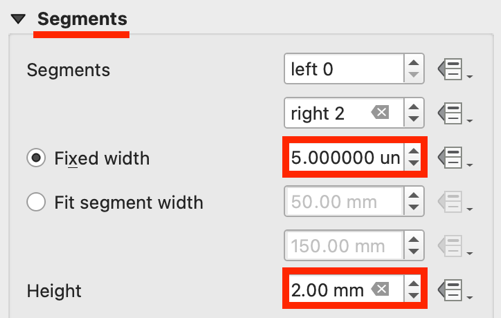

4.  Next, scroll down to the **Display** section and open the dropdown.
    Click on the box next to **Line Style** to change the color and
    weight of the line. I am going to change it to **white** and **0.5
    mm**. Click the **blue arrow** to return to the main Display
    section. Then, repeat the process with the **Division Style**. Once
    again, I am going to change the division lines to **white** and
    **0.5 mm** and then press the blue arrow to return to the Display
    section.

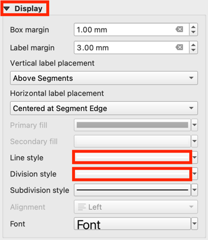
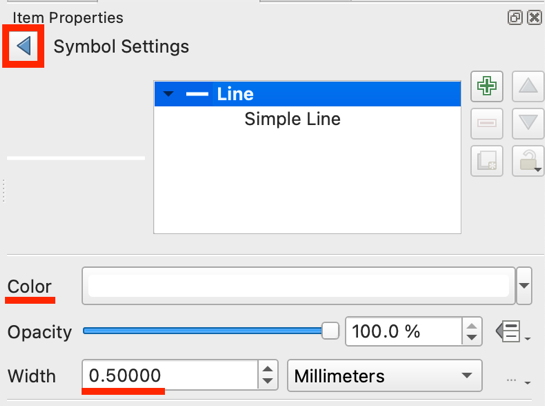

1.  Also in the **Display** section, you can change the font by clicking
    on the box next to font. Here you can adjust the **text font, style,
    size, and color** of the numbers on the scale bar. I am going to set
    mine to Arial, white, and size 10 points. Click the **blue arrow**
    to return.

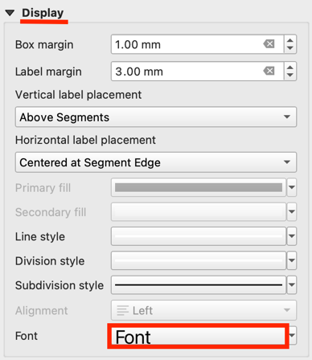
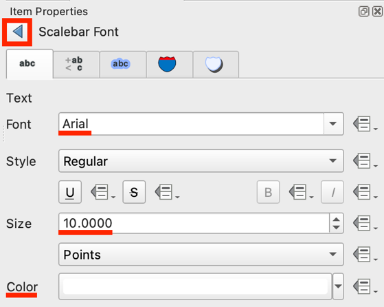

5.  Finally, you can also scroll down and add a **Background** and
    **Frame** to the scale bar, but I am going to leave mine as is.

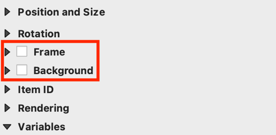

11. The last thing we should add to our layout is a **North arrow**. On
    the left tool bar, select the **Add North Arrow** button and **drag
    and drop** to add it to your map. Make sure you have the North arrow
    **selected**, and then go to the **Item Properties** pane. If you
    click on the **arrows** folder you will see different North arrow
    options under **SVG Images**. You can try the different options out.
    I will choose the simple north arrow with the N.

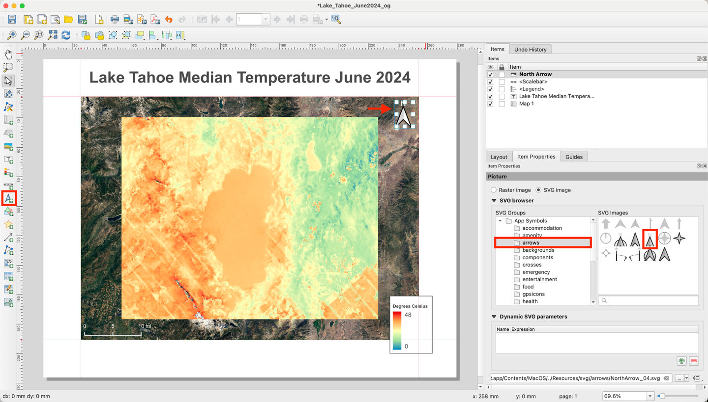

1.  If you scroll down to the **SVG Parameters** section, you can also
    change the **Fill color** and **Stroke color**. For now, I am going
    to leave the fill color **white**, and the stroke color **gray**.

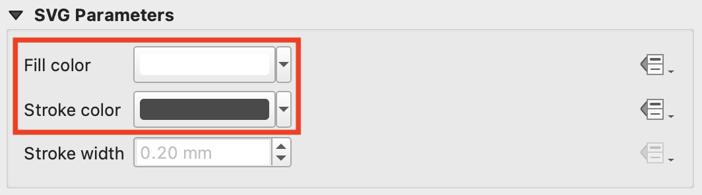

You now have a layout of your ECOSTRESS image!

## Exporting a Layout in QGIS

1.  When you have your layout set how you want, go to the top of the
    layout window and look for the export options. You can choose to
    either **Export as image**, **Export as SVG**, or **Export as PDF**.
    All of these options will open a pop-up where you can choose where
    to save your layout. I am going to choose to export the layout as an
    image.

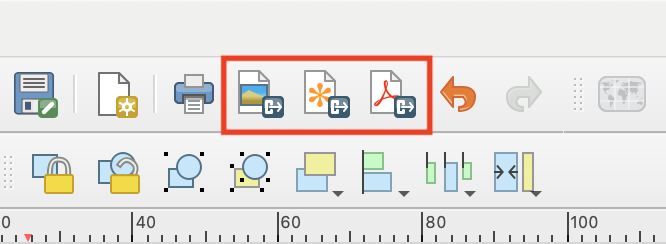

2.  If you get a pop-up that says **Project Contains WMS Layers** you
    can just select **Close**.

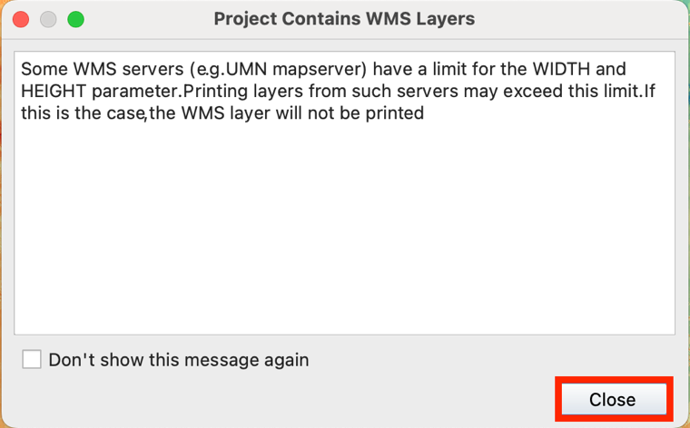

3.  Then, in the new pop-up, pick **where** you want to save it as well
    as the **format**. I am going to save mine as a **PNG**. Then click
    **Save**.

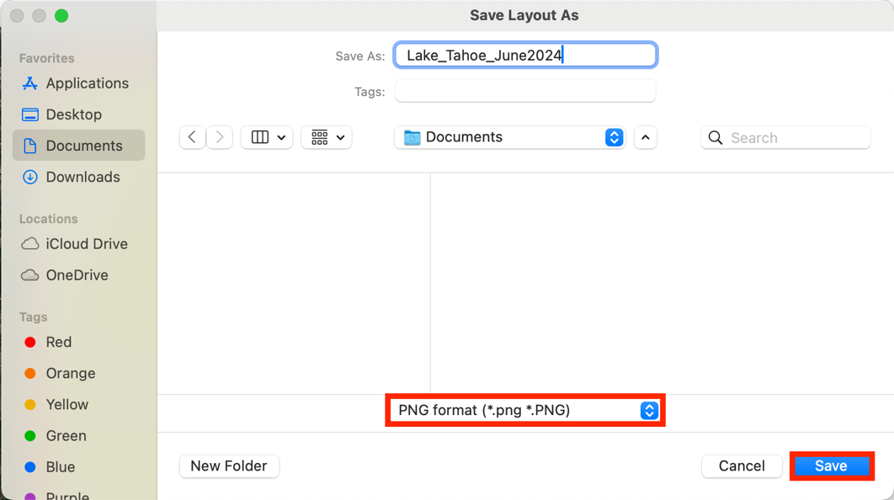

4.  Another pop-up will appear titled **Image** **Export Options**. You
    can adjust these if you want, but I am just going to press **Save**.

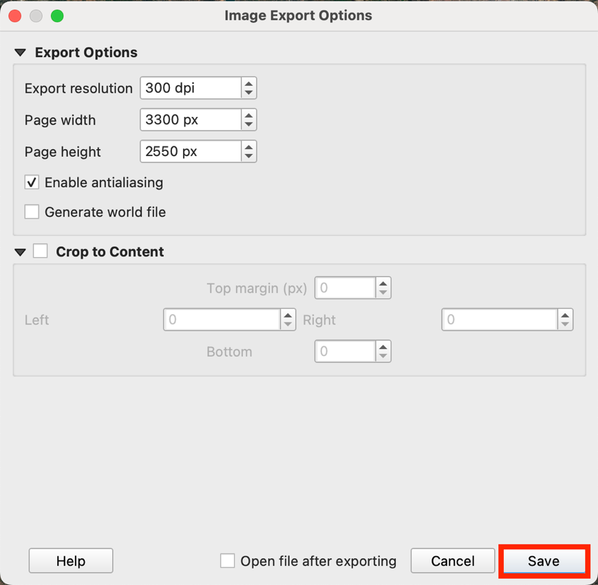

5.  Open your saved file and make sure it looks correct.

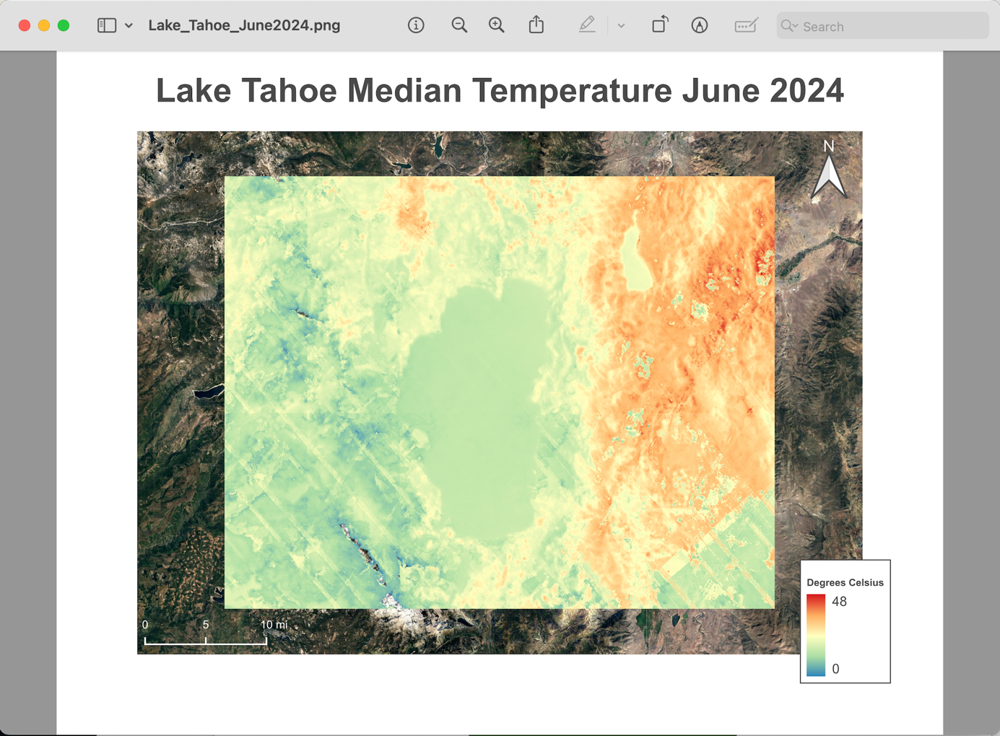

Now you have an exported ECOSTRESS image layout that is ready to be
shared!
